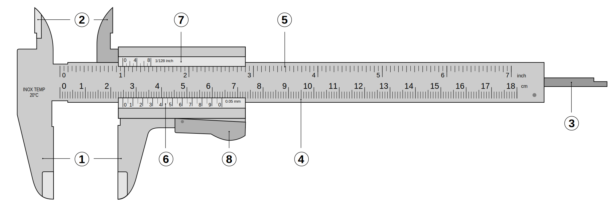

# 0.1. Przyrządy pomiarowe i ich dokładność

### Najważniejsze pojęcia

- **Zakres pomiarowy** — przedział wartości, jakie przyrząd w ogóle potrafi zmierzyć (np. termometr pokojowy: od −10°C do 50°C).
- **Działka elementarna** — odległość między dwiema sąsiednimi kreskami na skali przyrządu. To najmniejsza różnica, jaką w ogóle widać na skali.
- **Niepewność pomiaru (dokładność przyrządu)** — liczba mówiąca, o ile odczytany wynik może się różnić od wartości prawdziwej.
  - Dla przyrządów **analogowych** (ze skalą i wskazówką albo słupkiem, np. termometr cieczowy, siłomierz, taśma miernicza) przyjmujemy zwykle, że niepewność pomiaru to **połowa działki elementarnej**.
  - Dla przyrządów **cyfrowych** (np. waga elektroniczna) dokładność podaje producent — to zwykle wartość najmniejszej wyświetlanej cyfry (np. ±1 g).
  - Niektóre przyrządy (barometry, mierniki elektryczne) mają podaną **klasę dokładności**.

### Ciekawostka — kilogram, który przez 130 lat "pływał"

Do 20 maja 2019 roku istniał na świecie dosłownie **jeden konkretny przedmiot**, który był wzorcem masy 1 kg: walec ze stopu platyny i irydu (nazywany "Wielkim K"), przechowywany pod trzema szklanymi kopułami w Międzynarodowym Biurze Miar w Sèvres pod Paryżem. Wszystkie wagi na świecie były w ostatecznym rachunku kalibrowane względem *tego jednego kawałka metalu*.

Problem: nawet ten wzorzec miał swoją niepewność! Porównując go co kilkadziesiąt lat z urzędowymi kopiami przechowywanymi w innych krajach, metrolodzy zauważyli, że masy zaczynają się różnić — nawet o 50 mikrogramów (0,00000005 kg), prawdopodobnie z powodu mikroskopowych zanieczyszczeń powierzchni albo śladów czyszczenia. Skoro sam przedmiot-wzorzec "pływał", to niepewna była w gruncie rzeczy cała skala masy na świecie.

Dlatego w 2019 roku na nowo zdefiniowano kilogram — nie jako "ten konkretny walec", a przez stałą fizyczną, która (zgodnie z prawami fizyki) nigdy się nie zmienia: stałą Plancka $h = 6{,}62607015 \times 10^{-34}\ \text{J·s}$ (dziś to liczba przyjęta z definicji, bez niepewności). Do realizacji tej definicji służy m.in. specjalna waga elektromagnetyczna (waga Kibble'a). Wielki K trafił do muzeum.

**Morał:** nawet najlepszy możliwy wzorzec fizyczny ma swoją niepewność — dlatego naukowcy wolą definiować jednostki przez stałe przyrody, a nie przez konkretne przedmioty, które można zgubić, uszkodzić albo które po prostu "chudną".

> **Dziwne pytanie:** Czy istnieje przyrząd bez żadnej niepewności pomiaru?
>
> **Odpowiedź:** Nie — nawet teoretycznie. Każda skala pomiarowa ma jakąś najmniejszą działkę, a granicą ostateczną jest budowa materii (skala pomiarowa złożona jest z atomów, które mają swój rozmiar). Niepewność można zmniejszać — lepszym przyrządem, lepszą metodą — ale nigdy sprowadzić do idealnego zera.

### Klasa dokładności

Klasa dokładności to liczba (procent), która mówi, jaki maksymalny błąd może mieć przyrząd — liczony od **całego zakresu pomiarowego**, a nie od odczytanej wartości!

$$\text{niepewność} = \frac{\text{klasa dokładności}}{100} \times \text{zakres pomiarowy}$$

To ważne: taki przyrząd myli się o tyle samo (w liczbach bezwzględnych, np. w hPa), niezależnie od tego, czy wskazuje mało, czy dużo.

### Suwmiarka — skala z noniuszem

Suwmiarka ma dwie skale: główną (działka 1 mm) i dodatkową, ruchomą — **noniusz**, dzięki której możemy odczytać wynik dokładniej niż działka główna (np. z dokładnością 0,1 mm albo 0,05 mm — producent podaje to wprost na suwmiarce).

*Źródło: Joaquim Alves Gaspar (edycje: ed g2s, Anasofiapaixao), Wikimedia Commons, CC BY-SA 3.0 / CC BY 2.5 / GFDL — [File:Vernier caliper.svg](https://commons.wikimedia.org/wiki/File:Vernier_caliper.svg)*

Na rysunku widać ogólną budowę suwmiarki: szczęki do pomiarów zewnętrznych, szczęki do pomiarów wewnętrznych, głębokościomierz oraz skalę główną (w centymetrach i calach) z przesuwnym noniuszem — dzięki wyrównaniu kresek noniusza ze skalą główną można odczytać wynik dokładniej niż z samej działki głównej. Przykładowo, gdyby noniusz wskazał wynik `2,475 cm`, przy typowej dokładności noniusza `0,005 cm` zapisalibyśmy go jako `(2,475 ± 0,005) cm`.

### Przegląd typowych przyrządów

| Przyrząd | Do czego służy | Typowa działka elementarna | Jak liczymy niepewność |
|---|---|---|---|
| Waga (elektroniczna) | masa | np. 1 g | podana przez producenta |
| Suwmiarka | długość (małe przedmioty) | 1 mm (główna), z noniuszem 0,1 mm lub 0,05 mm | podana przez producenta |
| Termometr cieczowy | temperatura | np. 1°C lub 2°C | połowa działki elementarnej |
| Barometr | ciśnienie | zależnie od modelu | z klasy dokładności |
| Taśma miernicza | długość (duże odległości) | 1 mm lub 1 cm | z klasy dokładności lub połowa działki |
| Siłomierz | siła | np. 0,1 N | połowa działki elementarnej |

### Przykład

**Treść:** Barometr ma zakres pomiarowy `0–1050 hPa` i klasę dokładności `1,0`. Jaka jest niepewność pomiaru ciśnienia tym barometrem?

**Rozwiązanie:**

1. Ze wzoru: $\text{niepewność} = (\text{klasa}/100) \times \text{zakres pomiarowy}$.
2. Podstawiamy: $\text{niepewność} = (1{,}0/100) \times 1050\ \text{hPa} = 10{,}5\ \text{hPa}$.

**Odpowiedź:** Niepewność pomiaru tym barometrem wynosi `±10,5 hPa` — i to niezależnie od tego, czy przyrząd wskazuje `990 hPa`, czy `1040 hPa`.

[⬅ Powrót do spisu treści](0.0_pomiary_i_niepewnosci.md)
