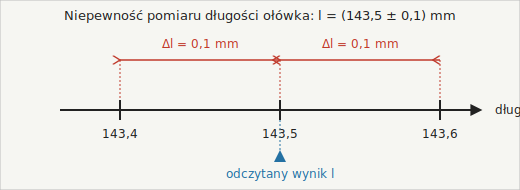

# 0.2. Niepewność pomiarowa i zapis wyniku pomiaru

Skoro wiemy już, że każdy przyrząd ma swoją dokładność, to wynik pomiaru musimy zapisać tak, by było jasne, w jakich granicach mieści się wartość prawdziwa. Robimy to w postaci:

$$x = x_{\text{odczyt}} \pm \Delta x \quad [\text{jednostka}]$$

gdzie:

- $x_{\text{odczyt}}$ — wartość, którą odczytaliśmy na przyrządzie,
- $\Delta x$ — niepewność pomiaru (zawsze dodatnia, w tej samej jednostce co wynik).

Taki zapis oznacza: **wartość prawdziwa mieści się gdzieś w przedziale od $(x_{\text{odczyt}} - \Delta x)$ do $(x_{\text{odczyt}} + \Delta x)$.** Nie wiemy dokładnie, gdzie w tym przedziale — wiemy tylko, że gdzieś tam jest.

Jednostkę zapisujemy zawsze po całym wyrażeniu, np. $l = (143{,}5 \pm 0{,}2)\ \text{mm}$ — nigdy osobno przy każdej liczbie.

*Ilustracja własna (nie znaleziono gotowego, licencjonowanego obrazka pasującego dokładnie do tego przykładu liczbowego 143,5 mm ± 0,2 mm).*

Wartość PRAWDZIWA długości ołówka na pewno leży gdzieś w przedziale od 143,3 mm do 143,7 mm — po prostu nie wiemy, w którym dokładnie miejscu tego przedziału.

### Ciekawostka — czy da się zmierzyć coś "idealnie", bez żadnego błędu?

Nie, nigdy. Nawet jeśli nie masz przy sobie żadnego przyrządu i szacujesz długość "na oko" — to również jest pomiar, tylko z bardzo dużą niepewnością (ogranicza ją Twój wzrok, doświadczenie, pamięć o tym, jak długi jest np. metr). Nie da się od niepewności "uciec" — można ją tylko zmniejszać, używając lepszego przyrządu albo lepszej metody.

To jedna z fundamentalnych różnic między fizyką a matematyką czystą. Liczba $\pi$ to abstrakcyjny obiekt matematyczny, więc możemy mówić o niej z dowolną, nieskończoną precyzją. Ale każda wielkość *zmierzona* w świecie rzeczywistym — długość stołu, czas spadku kulki, masa jabłka — ma niepewność, bo pomiar to zawsze porównanie z jakąś skalą, a każda skala ma ograniczoną rozdzielczość. Zdanie "zmierzyłem dokładnie 2 m, bez żadnego błędu" jest więc w fizyce **zawsze nieprawdziwe** — niepewność może być bardzo mała, ale nigdy nie jest równa zeru.

> **Dziwne pytanie:** Zmierzyłem tę samą rzecz dwa razy tym samym przyrządem i wyszły mi dwa różne wyniki. Który jest "ten prawdziwy"?
>
> **Odpowiedź:** Żaden — i to jest w porządku! Oba odczyty to tylko przybliżenia, każdy obarczony tą samą niepewnością $\Delta x$. Jeśli przyrząd działa dobrze, przedziały $(x_1 \pm \Delta x)$ i $(x_2 \pm \Delta x)$ powinny się nakładać — bo gdzieś w tym wspólnym obszarze leży wartość prawdziwa. Właśnie z tego powodu w prawdziwych doświadczeniach fizycy powtarzają pomiar wiele razy i liczą wartość średnią — to zwykle lepsze przybliżenie wartości prawdziwej niż pojedynczy odczyt.

### Przykład

**Treść:** Mierzysz długość ołówka suwmiarką o dokładności 0,1 mm. Odczytany wynik to 143,5 mm. Zapisz wynik pomiaru z niepewnością oraz podaj, w jakich granicach na pewno mieści się prawdziwa długość ołówka.

**Rozwiązanie:**

1. Niepewność suwmiarki wynosi Δl = 0,1 mm (podana przez producenta).
2. Zapis wyniku: $l = (143{,}5 \pm 0{,}1)\ \text{mm}$.
3. Granice przedziału: dolna = 143,5 − 0,1 = 143,4 mm; górna = 143,5 + 0,1 = 143,6 mm.

**Odpowiedź:** $l = (143{,}5 \pm 0{,}1)\ \text{mm}$. Prawdziwa długość ołówka mieści się między 143,4 mm a 143,6 mm.

[⬅ Powrót do spisu treści](0.0_pomiary_i_niepewnosci.md)
