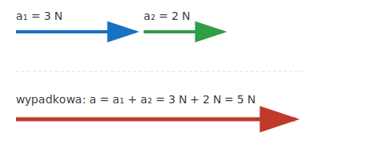
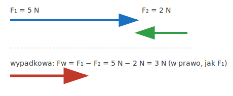
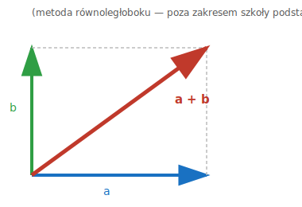

# 0.6. Skalary i wektory (rozszerzenie — poza podstawowym zakresem konkursu)

> **Uwaga:** ten podrozdział nie jest wprost wymagany w regulaminie konkursu zDolny Ślązak (zobacz `tematy.md`) — ale rozróżnienie skalar/wektor pomaga zrozumieć, *dlaczego* niektóre wzory w tym materiale wyglądają, jak wyglądają, i czemu przy niektórych symbolach (np. $\vec{F}$, $\vec{a}$) pojawia się strzałka, a przy innych (np. $m$, $t$, $T$) nigdy. Warto przeczytać ten rozdział raz, na spokojnie — a potem wracać do niego, gdy natrafisz na strzałkę nad symbolem gdzieś w innym temacie.

📚 *Zobacz na Khan Academy: [Wprowadzenie do wektorów i wielkości skalarnych](https://pl.khanacademy.org/science/physics/one-dimensional-motion/displacement-velocity-time/a/what-are-vectors)*

## Dwa rodzaje wielkości fizycznych

Każdą wielkość fizyczną, jaką mierzymy, można przypisać do jednej z dwóch grup:

- **Wielkość skalarna (skalar)** — w pełni opisuje ją **jedna liczba** (razem z jednostką). Nie ma "kierunku" — nie ma sensu pytać "w którą stronę?". Przykłady: masa (`m = 5 kg`), czas (`t = 10 s`), temperatura (`T = 20°C`), droga (`s = 100 m`), energia, praca, ciepło, gęstość, ciśnienie.
- **Wielkość wektorowa (wektor)** — do jej pełnego opisania potrzebujemy **trzech informacji**: wartości (liczby), kierunku i zwrotu (patrz temat 2.1, gdzie to samo rozróżnienie wprowadzamy dla siły). Przykłady: siła ($\vec{F}$), prędkość ($\vec{v}$), przyspieszenie ($\vec{a}$), przemieszczenie, siła wyporu.

Wektor rysujemy jako **strzałkę**: długość strzałki to wartość (moduł) wektora, a sama strzałka wskazuje kierunek i zwrot. W tekście i we wzorach wektor oznaczamy, dopisując strzałkę nad symbolem, np. $\vec{F}$ — bez strzałki (samo $F$) zwykle oznaczamy tylko **wartość** (moduł) tego wektora, czyli liczbę bez informacji o kierunku.

| Wielkość | Typ | Dlaczego? |
|---|---|---|
| masa $m$ | skalar | "5 kg" w pełni opisuje masę — nie ma "kierunku masy" |
| czas $t$ | skalar | "10 s" to kompletny opis — czas nie ma kierunku |
| temperatura $T$ | skalar | "20°C" to kompletny opis |
| droga $s$ | skalar | długość toru — samo "100 m", bez kierunku |
| praca $W$, energia $E$, ciepło $Q$ | skalar | zawsze tylko liczba + jednostka (dżul) |
| gęstość $\rho$, ciśnienie $p$ | skalar | tylko liczba + jednostka — **ciśnienie nie ma kierunku!** (częsty błąd — więcej w temacie 5.3) |
| siła $\vec{F}$ | wektor | "5 N" to niekompletny opis siły — musimy też wiedzieć, w którą stronę ona działa |
| prędkość $\vec{v}$, przyspieszenie $\vec{a}$ | wektor | mają wartość ORAZ kierunek i zwrot (patrz temat 1.1 i 2.1) |

## Dodawanie i odejmowanie wektorów o tym samym kierunku

To najprostszy przypadek — dokładnie taki, jak w temacie 2.4 przy składaniu sił działających wzdłuż jednej prostej:

- **Zgodne zwroty → wartości się dodają.**

- **Przeciwne zwroty → wartości się odejmują, a wypadkowa "idzie" w stronę większego wektora.**

Zauważ: to jest właściwie **odejmowanie wektorów** ukryte pod postacią dodawania — wektor "2 N w lewo" to po prostu wektor "2 N w prawo" pomnożony przez $-1$ (czyli obrócony o 180°). Odejmowanie wektorów $\vec{a} - \vec{b}$ to zawsze to samo, co dodawanie $\vec{a} + (-\vec{b})$, gdzie $-\vec{b}$ ma taką samą wartość jak $\vec{b}$, ale przeciwny zwrot.

### Przykład

**Treść:** Na łódkę działają dwie siły wzdłuż tej samej linii: silnik ciągnie ją do przodu siłą `F₁ = 400 N`, a opór wody działa do tyłu siłą `F₂ = 150 N`. Jaka jest wartość i zwrot siły wypadkowej?

**Rozwiązanie:**

Siły mają przeciwne zwroty, więc ich wartości odejmujemy:

$$F_w = F_1 - F_2 = 400\ \text{N} - 150\ \text{N} = 250\ \text{N}$$

Wypadkowa ma zwrot taki, jak większa z sił — czyli do przodu (zwrot siły `F₁`).

**Odpowiedź:** Siła wypadkowa ma wartość `250 N` i jest skierowana do przodu.

## A co, gdy wektory nie leżą na jednej linii?

W tym materiale (i na etapie szkolnym konkursu) prawie zawsze pracujemy z wektorami leżącymi na jednej prostej (tak jak wyżej) — to w pełni wystarcza do zrozumienia sił, prędkości i przyspieszeń w tym kursie. Gdy jednak dwa wektory są skierowane pod kątem względem siebie (np. jedna siła ciągnie w prawo, a druga do góry), ich suma **nie jest** zwykłym dodawaniem liczb — trzeba użyć tzw. metody równoległoboku (wypadkowa to przekątna równoległoboku zbudowanego na obu wektorach):

To wykracza poza zakres tego kursu (i konkursu) — tutaj wystarczy wiedzieć, że taka metoda istnieje i *dlaczego* w ogóle rozróżniamy skalary od wektorów: bo dla wektorów samo "$3 + 4$" nie zawsze daje "$7$" — czasem, jak tutaj (przy kącie 90°), daje $5$ (można to sprawdzić: to jest ten sam trójkąt o bokach 3-4-5, co w geometrii)!

## Jak to się ma do wzorów w innych tematach?

W kolejnych tematach zobaczysz, że nie każdy wzór z symbolem, który *oznacza* wektor (np. $F$, $v$, $a$), zapisujemy ze strzałką. Zasada, którą się kierujemy w tym materiale:

- Jeśli wzór jest **prawdziwym równaniem wektorowym** (obowiązuje niezależnie od kierunku, tak jak druga zasada dynamiki), piszemy go ze strzałkami: np. $\vec{F} = m\vec{a}$ (temat 2.3).
- Jeśli wzór w praktyce liczy tylko **wartość** (moduł) danej wielkości — bo interesuje nas "ile", a kierunek ustalamy słownie (np. "siła wypadkowa ma zwrot taki, jak większa z sił") albo kierunek nie ma znaczenia dla wyniku (np. energia, praca, ciśnienie) — piszemy go bez strzałek, zwykłymi literami, i zaznaczamy przy każdym symbolu w opisie wzoru, czy dana wielkość jest **(skalarem)** czy tylko **wartością wektora (wektor)**.

Ten sam symbol bywa więc czasem wektorem, a czasem tylko jego wartością — zależnie od konkretnego wzoru. Dlatego przy każdym wzorze w tym materiale znajdziesz teraz dopisek `(skalar)` albo `(wektor)` przy każdej wielkości — żeby zawsze było jasne, z czym masz do czynienia.

[⬅ Powrót do spisu treści](0.0_pomiary_i_niepewnosci.md)
