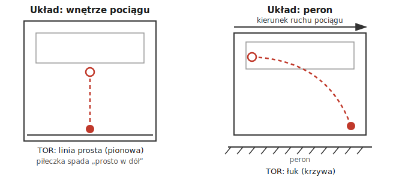

# 1.1. Względność ruchu, tor a droga

📚 *Zobacz na Khan Academy: [Wprowadzenie do układów odniesienia](https://pl.khanacademy.org/science/physics/one-dimensional-motion/displacement-velocity-time/v/introduction-to-reference-frames)*

📚 *Zobacz na Khan Academy: [Czym jest przemieszczenie?](https://pl.khanacademy.org/science/physics/one-dimensional-motion/displacement-velocity-time/a/what-is-displacement)*

### Ruch jest względny

Ciało **porusza się**, jeśli zmienia swoje położenie względem innego ciała, które nazywamy **układem odniesienia** (albo punktem odniesienia). To bardzo ważne: **nie ma ruchu "samego w sobie"** — zawsze musimy powiedzieć, względem czego coś się porusza.

Klasyczny przykład: siedzisz w jadącym pociągu i czytasz książkę.

- Względem **wnętrza pociągu** (fotela, podłogi) — jesteś w spoczynku, nie zmieniasz położenia.
- Względem **peronu i torów** — poruszasz się razem z pociągiem, np. z prędkością `100 km/h`.

Obie odpowiedzi są poprawne! Po prostu opisują ruch względem różnych układów odniesienia.

### Ciekawostka: "siedzę spokojnie", a mimo to pędzę z prędkością kosmiczną

Kiedy siedzisz w fotelu i czytasz ten tekst, wydaje się, że jesteś w spoczynku — względem podłogi i ścian pokoju to prawda. Ale te same ściany razem z całą Ziemią niosą Cię przez przestrzeń kosmiczną z absurdalnie dużymi prędkościami, i to jednocześnie:

- Ziemia obraca się wokół własnej osi — na równiku punkt na jej powierzchni porusza się z prędkością ok. **`1670 km/h`** (w Polsce, bliżej bieguna, trochę mniej, ale to wciąż ponad `1000 km/h`).
- Ziemia okrąża Słońce — lecimy razem z nią z prędkością ok. **`107 000 km/h`** (prawie `30 km/s`!).
- Cały Układ Słoneczny okrąża centrum Drogi Mlecznej z prędkością ok. **`800 000 km/h`**.

Wszystkie te prędkości "nakładają się" na siebie, a jednak nie czujesz nawet najmniejszego ciągu. Dlaczego? Bo (jak zobaczysz w rozdziale 1.3) nasze ciało nie wykrywa prędkości — wykrywa tylko jej *zmianę*, czyli przyspieszenie. Skoro w każdej krótkiej chwili te prędkości są praktycznie stałe, nic nam nie "mówi", że się poruszamy.

> **Dziwne pytanie:** To względem czego naprawdę "stoję w miejscu"? — Odpowiedź: nigdy nie da się powiedzieć, że coś jest "naprawdę" w spoczynku, bez wskazania układu odniesienia — takie pytanie po prostu nie ma sensu. Możesz być w spoczynku względem krzesła i jednocześnie pędzić względem Słońca z prędkością `107 000 km/h`. Obie odpowiedzi są równie "prawdziwe" — to właśnie jest sens względności ruchu.

### Tor a droga — to nie to samo

- **Tor ruchu** — linia (krzywa) zakreślona przez poruszające się ciało w przestrzeni. Tor może być prostoliniowy (linia prosta) albo krzywoliniowy (np. łuk, okrąg, parabola).
- **Droga ($s$, skalar)** — długość toru, czyli jak długi "sznurek" trzeba by rozciągnąć wzdłuż całej trasy ciała. Drogę mierzymy w metrach (m), kilometrach (km) itd. Droga jest zawsze liczbą dodatnią (albo zerem) — nigdy nie jest ujemna. W tym temacie droga `s` jest zawsze skalarem — nie ma "kierunku drogi" (zobacz temat 0.6).

Co ciekawe, **ten sam ruch może mieć różny tor w zależności od układu odniesienia** — dokładnie tak samo jak sama informacja "porusza się czy nie".

#### Ilustracja: tor tego samego ruchu w dwóch układach odniesienia

Wyobraź sobie osobę w jadącym pociągu, która upuszcza piłeczkę. Zobaczmy, jak wygląda tor lotu piłeczki dla dwóch różnych obserwatorów.

*Ilustracja własna (nie znaleziono w otwartych zasobach gotowego diagramu odpowiadającego dokładnie temu scenariuszowi) — schemat klasycznego eksperymentu myślowego: piłeczka upuszczona w jadącym pociągu, widziana z dwóch układów odniesienia.*

Dla pasażera tor jest prostą pionową linią. Dla obserwatora na peronie — łukiem (krzywą), bo piłeczka porusza się jednocześnie w dół i do przodu (razem z pociągiem). **Oba opisy są prawdziwe** — różnią się tylko układem odniesienia.

> **Uwaga na zadania konkursowe:** W zadaniach zDolny Ślązak bardzo często pojawia się pytanie o to, czy ktoś (np. konduktor idący przez wagon) porusza się względem torów tak samo, jak porusza się względem pociągu. Zawsze czytaj uważnie, **względem czego** pytanie dotyczy ruchu!

### Prędkość względna — liczbowo

Gdy dwa ciała poruszają się wzdłuż tej samej prostej, prędkość jednego z nich **względem drugiego** (a nie względem podłoża) obliczamy, dodając lub odejmując ich prędkości względem podłoża — dokładnie tak samo jak przy składaniu sił wzdłuż jednej prostej (zobacz temat 2.4 i 0.6):

- Jeśli poruszają się **w tę samą stronę** — prędkość względna to **różnica** wartości ich prędkości.
- Jeśli poruszają się **w przeciwne strony** — prędkość względna to **suma** wartości ich prędkości.

**Przykład:** Konduktor idzie przez wagon ku końcowi pociągu z prędkością `4 km/h` względem pociągu. Pociąg jedzie względem torów z prędkością `100 km/h`, w tę samą stronę, co konduktor. Jaka jest prędkość konduktora względem torów?

Konduktor porusza się względem pociągu w tę samą stronę, w którą pociąg porusza się względem torów, więc prędkości się dodają: $v = 100\ \text{km/h} + 4\ \text{km/h} = 104\ \text{km/h}$.

Gdyby konduktor szedł **w stronę czoła pociągu** (czyli pod prąd ruchu pociągu), prędkości odejmowalibyśmy: $v = 100\ \text{km/h} - 4\ \text{km/h} = 96\ \text{km/h}$.

### Przykład

**Treść zadania:** Marek jedzie na deskorolce po prostym, płaskim chodniku od ławki do latarni (`5 m`), a potem zawraca i wraca do ławki. Jaka jest droga przebyta przez Marka? Czy jego tor jest linią prostą?

**Rozwiązanie krok po kroku:**

1. Droga w jedną stronę (ławka → latarnia) wynosi `5 m`.
2. Droga w drugą stronę (latarnia → ławka) też wynosi `5 m`, bo to ta sama trasa.
3. Całkowita droga to suma: $s = 5\ \text{m} + 5\ \text{m} = 10\ \text{m}$.
4. Tor — Marek cały czas porusza się po tej samej linii (chodnik jest prosty), więc tor jest odcinkiem prostej — mimo że Marek zawrócił!

**Odpowiedź:** Marek przejechał drogę $s = 10\ \text{m}$ (skalar), a jego tor jest linią prostą (choć przemierzoną "w dwie strony").

*(Warto zauważyć różnicę względem tzw. przemieszczenia — wielkości wektorowej opisującej, o ile i w którym kierunku zmieniło się położenie na końcu ruchu. W tym przykładzie przemieszczenie Marka wynosi `0`, bo wrócił do punktu startu, mimo że droga wynosi `10 m`. W szkole podstawowej skupiamy się głównie na drodze.)*

[⬅ Powrót do spisu treści](1.0_kinematyka.md)
