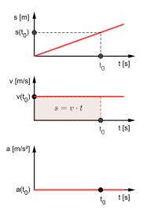

# 1.2. Ruch jednostajny: droga, prędkość

📚 *Zobacz na Khan Academy: [Czym jest prędkość?](https://pl.khanacademy.org/science/physics/one-dimensional-motion/displacement-velocity-time/a/what-is-velocity)*

📚 *Zobacz na Khan Academy: [Obliczanie średniej prędkości lub szybkości](https://pl.khanacademy.org/science/physics/one-dimensional-motion/displacement-velocity-time/v/calculating-average-velocity-or-speed)*

### Co to jest ruch jednostajny?

**Ruch jednostajny prostoliniowy** to ruch, w którym ciało porusza się po linii prostej i w **równych odstępach czasu pokonuje jednakowe odcinki drogi**. Innymi słowy — wartość prędkości się nie zmienia (jest stała).

### Prędkość

**Prędkość (v)** mówi nam, jak szybko zmienia się droga w czasie. Dla ruchu jednostajnego:

$$v = \frac{s}{t}$$

gdzie:

- $v$ — prędkość (wektor — tu użyta wartość) [m/s lub km/h]
- $s$ — droga (skalar) [m lub km]
- $t$ — czas (skalar) [s, min, h]

**Uwaga:** prędkość i przyspieszenie są z natury wielkościami wektorowymi (mają kierunek i zwrot — zobacz temat 0.6 i 2.1) — ale skoro w tym temacie śledzimy drogę `s` (skalar) w ruchu jednostajnym (który z definicji nie zmienia kierunku), we wzorach używamy tylko ich *wartości* (czyli samych liczb, bez informacji o kierunku). W temacie 2 (siły i dynamika) zobaczysz te same symbole zapisane jako pełne wektory, np. $\vec{a}$ we wzorze II zasady dynamiki, a w rozszerzeniu 1.7 zobaczysz, jak zapisać prędkość i przyspieszenie liczbami ze znakiem, gdy ciało zmienia zwrot ruchu.

Z tego wzoru można też wyznaczyć drogę i czas:

$$s = v \cdot t \qquad\qquad t = \frac{s}{v}$$

### Prędkość średnia

Jeśli ciało nie porusza się jednostajnie (raz szybciej, raz wolniej), możemy policzyć jego **prędkość średnią** — czyli tak, jakby całą drogę pokonało jednostajnie w tym samym czasie:

$$v_{śr} = \frac{s_{całkowite}}{t_{całkowite}}$$

To bardzo częsty typ zadania na konkursach — **prędkość średnia to zawsze cała droga podzielona przez cały czas**, a nie średnia arytmetyczna prędkości cząstkowych!

### Zaskakujący przykład: pułapka "prędkości średniej"

Kierowca jedzie z miasta A do miasta B. Pierwszą połowę drogi (np. w korku) jedzie z prędkością `60 km/h`, a drugą połowę (już poza miastem) — `120 km/h`. Czy jego prędkość średnia na całej trasie to $(60 + 120) / 2 = 90$ km/h?

**Nie!** Sprawdźmy to na konkretnych liczbach — niech każda połowa trasy ma po `120 km`:

- Czas na pierwszą połowę: $t_1 = 120\ \text{km} / 60\ \text{km/h} = 2$ h.
- Czas na drugą połowę: $t_2 = 120\ \text{km} / 120\ \text{km/h} = 1$ h.
- Droga całkowita: $s = 120 + 120 = 240$ km. Czas całkowity: $t = 2 + 1 = 3$ h.
- Prędkość średnia: $v_{śr} = 240\ \text{km} / 3\ \text{h} = 80$ km/h.

Wynik to **`80 km/h`, a nie `90 km/h`**! Dzieje się tak, bo kierowca spędził więcej czasu, jadąc wolniej (`2 h` przy `60 km/h`), niż jadąc szybciej (`1 h` przy `120 km/h`) — a prędkość średnia "waży" prędkości czasem, który przy nich spędziliśmy, a nie traktuje ich wszystkich jednakowo. Dlatego zawsze licz $v_{śr}$ z definicji (cała droga / cały czas), a nie ze średniej arytmetycznej prędkości, jeśli poszczególne etapy trwają różny czas!

### Dziwne pytanie: czy Achilles w ogóle dogoni żółwia?

Starożytny grecki filozof Zenon z Elei zadał pytanie, które przez wieki zbijało z tropu nawet matematyków. Szybkobiegacz Achilles startuje do wyścigu z żółwiem, który ma niewielką przewagę (fory). Zenon rozumował tak: zanim Achilles dogoni żółwia, musi najpierw dobiec do miejsca, w którym żółw właśnie był — a w tym czasie żółw zdąży się przesunąć nieco dalej. Potem Achilles musi dobiec do tego nowego miejsca — a żółw znowu ucieknie choć trochę dalej. I tak w kółko, bez końca! Czy to znaczy, że Achilles nigdy nie dogoni żółwia?

Na szczęście — nie, to tylko **pozorny** paradoks. Choć "kroków" jest nieskończenie wiele, każdy kolejny trwa coraz krócej, a suma nieskończenie wielu, coraz krótszych odcinków czasu może być liczbą skończoną. Sprawdźmy to, korzystając po prostu ze wzoru $v = s/t$, zamiast liczyć nieskończone kroki: niech Achilles biegnie z prędkością `10 m/s`, a żółw pełznie z prędkością `1 m/s`, mając `100 m` przewagi. Odległość między nimi zmniejsza się z prędkością $10 - 1 = 9$ m/s, więc czas, po którym Achilles dogoni żółwia, wynosi $t = 100\ \text{m} / 9\ \text{m/s} \approx 11{,}1$ s — konkretna, skończona liczba! Fizyka doskonale radzi sobie z opisem ruchu, mimo że pozornie "nieskończone" rozumowanie mogłoby sugerować inaczej.

#### Ilustracja: wykres drogi od czasu s(t) dla ruchu jednostajnego

*Źródło: MikeRun, [Uniform-motion.svg](https://commons.wikimedia.org/wiki/File:Uniform-motion.svg), licencja CC BY-SA 4.0, Wikimedia Commons. (Ilustracja pokazuje od razu trzy powiązane wykresy tego samego ruchu — dla ruchu jednostajnego najważniejszy jest tu górny wykres s(t): linia prosta, czyli znak rozpoznawczy ruchu jednostajnego. Nachylenie tej prostej to właśnie wartość prędkości.)*

Im bardziej stroma prosta, tym większa prędkość. Prosta pozioma (`nachylenie = 0`) oznaczałaby, że ciało stoi w miejscu.

### Przykład

**Treść zadania:** Pociąg towarowy porusza się ruchem jednostajnym z prędkością `72 km/h`. Jaką drogę przejedzie w ciągu `15 minut`? Podaj wynik w kilometrach.

**Rozwiązanie krok po kroku:**

1. Zamieniamy jednostki tak, by były spójne. Prędkość: `72 km/h`. Czas: `15 minut = 0,25 h` (bo `15 min : 60 min = 0,25`).
2. Korzystamy ze wzoru: $s = v \cdot t$.
3. Podstawiamy dane: $s = 72\ \text{km/h} \cdot 0{,}25\ \text{h} = 18\ \text{km}$.

**Odpowiedź:** Pociąg przejedzie `18 km`.

[⬅ Powrót do spisu treści](1.0_kinematyka.md)
