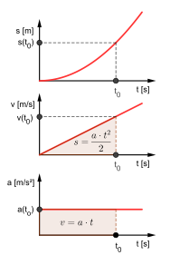

# 1.3. Ruch jednostajnie zmienny (przyspieszony, opóźniony): przyspieszenie

📚 *Zobacz na Khan Academy: [Czym jest przyspieszenie?](https://pl.khanacademy.org/science/physics/one-dimensional-motion/acceleration-tutorial/a/acceleration-article)*

### Kiedy prędkość się zmienia

W realnym życiu prędkość rzadko jest stała — samochód rusza z miejsca, rowerzysta hamuje przed skrzyżowaniem. Gdy **prędkość zmienia się o taką samą wartość w każdej sekundzie**, mówimy o **ruchu jednostajnie zmiennym**:

- **ruch jednostajnie przyspieszony** — wartość prędkości rośnie (np. auto przyspiesza),
- **ruch jednostajnie opóźniony** — wartość prędkości maleje (np. auto hamuje).

### Przyspieszenie

**Przyspieszenie (a)** mówi nam, o ile zmienia się prędkość w jednostce czasu:

$$a = \frac{\Delta v}{\Delta t} = \frac{v - v_0}{t}$$

gdzie:

- $a$ — przyspieszenie (m/s²)
- $v_0$ — prędkość początkowa
- $v$ — prędkość końcowa
- $t$ — czas, w którym nastąpiła ta zmiana

Jeśli prędkość rośnie, przyspieszenie jest dodatnie (ruch przyspieszony). Jeśli prędkość maleje, mówimy, że ciało ma **opóźnienie** (czasem zapisywane jako przyspieszenie ujemne względem kierunku ruchu).

Przekształcając wzór, możemy obliczyć prędkość po czasie t, znając przyspieszenie:

$$v = v_0 + a \cdot t$$

Drogę w ruchu jednostajnie przyspieszonym (startującym z $v_0 = 0$) liczymy wzorem:

$$s = \frac{a \cdot t^2}{2}$$

Gdy prędkość początkowa nie jest zerowa, wzór ogólny na drogę to $s = v_0 \cdot t + \frac{a \cdot t^2}{2}$. Łącząc go ze wzorem $v = v_0 + at$ (i eliminując czas t), otrzymujemy przydatny wzór bez czasu, wiążący prędkości i drogę bezpośrednio:

$$v^2 = v_0^2 + 2as$$

(dla ruchu opóźnionego przyspieszenie $a$ wstawiamy ze znakiem minus, np. $v^2 = v_0^2 - 2as$).

### Jednostka przyspieszenia

Przyspieszenie wyrażamy w **metrach na sekundę do kwadratu (m/s²)**. Oznacza to: "o ile metrów na sekundę zmienia się prędkość w ciągu jednej sekundy". Np. $a = 2\ \text{m/s}^2$ znaczy, że co sekundę prędkość rośnie o 2 m/s.

#### Ilustracja: wykres prędkości od czasu v(t) — pole pod wykresem to droga!

*Źródło: MikeRun, [Uniform-acceleration.svg](https://commons.wikimedia.org/wiki/File:Uniform-acceleration.svg), licencja CC BY-SA 4.0, Wikimedia Commons. (Najważniejszy jest tu środkowy wykres v(t) — zacieniowany trójkąt pod prostą to pole równe drodze. Działa to dokładnie tak samo jak dla rowerzysty z przykładu poniżej, gdzie v rośnie od 0 do 8 m/s w ciągu 4 s.)*

To bardzo ważna zasada, wykorzystywana w wielu zadaniach konkursowych: **pole powierzchni pod wykresem v(t) (między wykresem a osią czasu) zawsze jest równe drodze przebytej w danym przedziale czasu** — niezależnie od tego, czy ruch jest jednostajny, przyspieszony, czy opóźniony.

### Przykład

**Treść zadania:** Rowerzysta rusza z miejsca (czyli $v_0 = 0$) i porusza się ruchem jednostajnie przyspieszonym. Po 4 sekundach jego prędkość wynosi 8 m/s. Oblicz przyspieszenie roweru oraz drogę przebytą w ciągu tych 4 sekund.

**Rozwiązanie krok po kroku:**

1. Dane: $v_0 = 0$, $v = 8$ m/s, $t = 4$ s.
2. Przyspieszenie: $a = \dfrac{v - v_0}{t} = \dfrac{8\ \text{m/s} - 0}{4\ \text{s}} = 2\ \text{m/s}^2$.
3. Droga (start z $v_0=0$): $s = \dfrac{a \cdot t^2}{2} = \dfrac{2\ \text{m/s}^2 \cdot (4\ \text{s})^2}{2} = \dfrac{2 \cdot 16}{2} = 16$ m.
4. Możemy to sprawdzić polem pod wykresem trójkąta v(t): $s = \frac12 \cdot 4\,\text{s} \cdot 8\,\text{m/s} = 16$ m — zgadza się!

**Odpowiedź:** Przyspieszenie rowerzysty wynosi 2 m/s², a przebyta droga to 16 m.

[⬅ Powrót do spisu treści](1.0_kinematyka.md)
