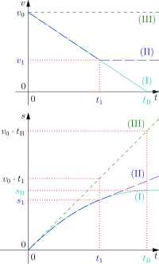

# 1.4. Wykresy zależności drogi, prędkości i przyspieszenia od czasu

📚 *Zobacz na Khan Academy: [Czym są wykresy położenia w zależności od czasu?](https://pl.khanacademy.org/science/physics/one-dimensional-motion/displacement-velocity-time/a/position-vs-time-graphs)*

📚 *Zobacz na Khan Academy: [Interpretacja wykresów prędkości w zależności od czasu](https://pl.khanacademy.org/science/physics/one-dimensional-motion/acceleration-tutorial/a/what-are-velocity-vs-time-graphs)*

Wykresy to "język", którym fizycy opisują ruch bez słów. Warto znać, jak wyglądają dla trzech podstawowych rodzajów ruchu.

| Rodzaj ruchu | wykres s(t) | wykres v(t) | wykres a(t) |
|---|---|---|---|
| Spoczynek (brak ruchu) | linia pozioma | linia pozioma na poziomie 0 | linia pozioma na poziomie 0 |
| Ruch jednostajny | linia prosta ukośna | linia pozioma (stała wartość) | linia pozioma na poziomie 0 |
| Ruch jednostajnie przyspieszony | krzywa (parabola), coraz bardziej stroma | linia prosta ukośna, rosnąca | linia pozioma (stała wartość > 0) |
| Ruch jednostajnie opóźniony | krzywa, coraz mniej stroma | linia prosta ukośna, malejąca | linia pozioma (stała wartość < 0) |

#### Ilustracja: trzy wykresy obok siebie dla ruchu jednostajnie przyspieszonego

*Źródło: MikeRun, [Uniform-acceleration.svg](https://commons.wikimedia.org/wiki/File:Uniform-acceleration.svg), licencja CC BY-SA 4.0, Wikimedia Commons. Droga rośnie coraz szybciej (parabola), prędkość rośnie liniowo (prosta nachylona), a przyspieszenie jest stałe (linia pozioma).*

#### Ilustracja: wykresy v(t) i s(t) dla ruchu jednostajnie opóźnionego (hamowanie)

*Źródło: SweetWood, [Graphs of speed and displacement during braking with constant deceleration.svg](https://commons.wikimedia.org/wiki/File:Graphs_of_speed_and_displacement_during_braking_with_constant_deceleration.svg), domena publiczna (CC0), Wikimedia Commons.*

Na wykresie widoczne są trzy warianty ruchu — dla naszego tematu (ruch jednostajnie opóźniony aż do zatrzymania) najważniejsza jest krzywa **(I)**:

- **Wykres v(t), krzywa (I):** prędkość maleje liniowo od wartości początkowej $v_0$ do zera w chwili $t_B$ — to właśnie prosta malejąca, o której mowa w tabeli powyżej. Nachylenie tej prostej (ujemne) to wartość przyspieszenia — tu opóźnienia.
- **Wykres s(t), krzywa (I):** droga rośnie coraz wolniej — krzywa jest coraz mniej stroma, aż w chwili $t_B$ (gdy ciało się zatrzymuje) staje się pozioma (droga przestaje rosnąć, bo ciało stoi w miejscu).
- Krzywa **(II)** pokazuje wariant pośredni — ciało zwalnia tym samym opóźnieniem, ale tylko do pewnej mniejszej prędkości $v_1$ (nie do zera), a potem jedzie dalej ze stałą prędkością $v_1$ — stąd załamanie na wykresie s(t) z krzywej w prostą.
- Krzywa **(III)** to ruch jednostajny bez żadnego hamowania — dodana tylko dla porównania (prosta rosnąca na wykresie v(t) w stałej wysokości, i linia prosta ukośna na wykresie s(t)).

Wykresu a(t) dla tego ruchu nie trzeba osobno rysować — skoro opóźnienie jest stałe, to (tak jak w tabeli powyżej) jest to po prostu **pozioma linia poniżej zera** (wartość ujemna, stała w czasie), aż do chwili zatrzymania.

**Jak czytać takie wykresy w zadaniach:**

- Z wykresu **s(t)**: prędkość odpowiada nachyleniu (stromości) krzywej w danym momencie.
- Z wykresu **v(t)**: droga to pole powierzchni pod wykresem, a przyspieszenie to nachylenie prostej.
- Z wykresu **a(t)**: pole pod wykresem to zmiana prędkości ($\Delta v$).

### Przykład

**Treść zadania:** Na wykresie v(t) rowerzysta w ciągu pierwszych 3 sekund przyspiesza jednostajnie od 0 do 6 m/s, a potem przez kolejne 5 sekund jedzie ze stałą prędkością 6 m/s. Jaką drogę przejechał w ciągu tych 8 sekund łącznie?

**Rozwiązanie krok po kroku:**

1. Dzielimy wykres na dwa fragmenty i liczymy pole pod każdym z nich osobno.
2. Fragment I (0–3 s, trójkąt): $s_1 = \frac12 \cdot 3\,\text{s} \cdot 6\,\text{m/s} = 9$ m.
3. Fragment II (3–8 s, prostokąt, bo prędkość stała): $s_2 = 6\,\text{m/s} \cdot 5\,\text{s} = 30$ m.
4. Droga całkowita: $s = s_1 + s_2 = 9\,\text{m} + 30\,\text{m} = 39$ m.

**Odpowiedź:** Rowerzysta przejechał łącznie 39 m.

[⬅ Powrót do spisu treści](1.0_kinematyka.md)
