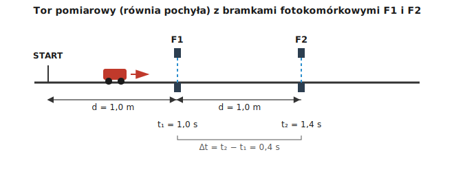

# 1.6. Pomiary charakterystyk ruchu

### Czym mierzymy ruch?

Żeby opisać ruch liczbowo, potrzebujemy zmierzyć dwie podstawowe wielkości: **drogę** i **czas** (z nich obliczamy prędkość i przyspieszenie).

- **Drogę** mierzymy np. taśmą mierniczą, linijką, przymiarem, a na dłuższych odcinkach — np. licznikiem obrotów koła roweru albo licznikiem kilometrów w samochodzie (drogomierz, ang. odometer).
- **Czas** mierzymy stoperem (ręcznym lub w telefonie), a w bardziej precyzyjnych eksperymentach — **bramkami fotokomórkowymi** połączonymi z elektronicznym licznikiem czasu, który reaguje na przecięcie promienia światła przez poruszający się obiekt.

### Prędkość chwilowa a prędkość średnia — jak je zmierzyć?

- **Prędkość średnia** na odcinku wyznaczamy, mierząc całą drogę i cały czas jej pokonania, a potem dzieląc: $v_{śr} = s/t$.
- **Prędkość chwilową** (w danym momencie) najprościej zmierzyć, biorąc **bardzo krótki** odcinek drogi i bardzo krótki czas jego pokonania — im krótszy odcinek, tym dokładniej opisujemy prędkość "w tym jednym momencie". W praktyce szkolnej prędkościomierz roweru czy samochodu robi dokładnie to — mierzy bardzo mały odcinek drogi w bardzo małym czasie i pokazuje wynik na bieżąco.

### Jak zmierzyć przyspieszenie w prostym doświadczeniu?

Typowe doświadczenie: puszczamy wózek (albo kulkę) na równi pochyłej i mierzymy czas przejazdu między dwiema bramkami fotokomórkowymi ustawionymi w znanej odległości od siebie. Znając odległość między bramkami oraz zmierzony czas, możemy policzyć prędkość średnią na tym odcinku; robiąc pomiar na kilku kolejnych odcinkach, możemy sprawdzić, czy (i jak) prędkość rośnie — a stąd wyznaczyć przyspieszenie.

#### Ilustracja: pomiar prędkości za pomocą bramek fotokomórkowych

*Ilustracja własna (nie znaleziono w otwartych zasobach gotowego diagramu odpowiadającego dokładnie temu układowi pomiarowemu) — schemat toru pomiarowego z dwiema bramkami fotokomórkowymi.*

Odległość między bramkami F1 i F2 wynosi `d = 1,0 m`. Elektroniczny stoper zatrzymany przez wiązkę światła zmierzył:

- chwila przejścia przez F1: $t_1 = 1{,}0$ s (licząc od startu),
- chwila przejścia przez F2: $t_2 = 1{,}4$ s (licząc od startu).

Czas między bramkami: $\Delta t = t_2 - t_1 = 0{,}4$ s.

Prędkość średnia między F1 a F2: $v = d / \Delta t = 1{,}0\ \text{m} / 0{,}4\ \text{s} = 2{,}5\ \text{m/s}$.

Taki pomiar jest dużo dokładniejszy niż mierzenie stoperem "ręcznie", bo bramka reaguje na promień światła w ułamku sekundy, a reakcja człowieka na stoperze trwa zwykle `0,2–0,3 sekundy` (i to jest źródło niepewności pomiaru!).

### Niepewność pomiaru w kinematyce

Każdy pomiar ma pewną niepewność (patrz też temat 0). W pomiarach ruchu najważniejsze źródła niepewności to:

- czas reakcji osoby obsługującej stoper,
- dokładność przyrządu do mierzenia długości (np. działka elementarna taśmy mierniczej),
- to, czy ruch faktycznie jest jednostajny (a nie tylko "w przybliżeniu" jednostajny).

### Ciekawostka: jak zmierzyć odległość burzy, nie ruszając się z miejsca?

Światło błyskawicy dociera do naszych oczu praktycznie natychmiast (prędkość światła to ok. `300 000 km/s`), natomiast grzmot — falę dźwiękową — słyszymy z zauważalnym opóźnieniem, bo prędkość dźwięku w powietrzu to "tylko" ok. `340 m/s`. To pozwala na bardzo praktyczny pomiar: policz (np. stoperem) liczbę sekund między błyskiem a grzmotem, a potem podziel ją przez ok. `3` — otrzymasz w ten sposób odległość burzy w kilometrach!

Skąd to "dzielenie przez 3"? Ze wzoru $s = v \cdot t$: czas, w jakim dźwięk pokonuje `1 km`, to $1000\ \text{m} / 340\ \text{m/s} \approx 2{,}9$ s, czyli w zaokrągleniu `3 sekundy` na każdy kilometr. Jeśli więc grzmot słyszysz `9 sekund` po błysku, burza jest ok. $9 / 3 = 3$ km od Ciebie. To pomiar odległości metodą `droga = prędkość razy czas` — bez żadnej taśmy mierniczej, jedynie za pomocą stopera i wzoru kinematyki!

### Przykład

**Treść zadania:** Uczniowie mierzą prędkość kulki tocznej z równi. Kulka pokonuje odcinek `2,4 m` w czasie zmierzonym stoperem: `3 pomiary` dały wyniki `1,9 s`, `2,1 s` i `2,0 s`. Oblicz prędkość średnią kulki, korzystając ze średniej arytmetycznej z pomiarów czasu.

**Rozwiązanie krok po kroku:**

1. Liczymy średni czas z trzech pomiarów: $t_{śr} = \dfrac{1{,}9 + 2{,}1 + 2{,}0}{3}\ \text{s} = \dfrac{6{,}0}{3}\ \text{s} = 2{,}0$ s.
2. Korzystamy ze wzoru na prędkość: $v = \dfrac{s}{t_{śr}} = \dfrac{2{,}4\ \text{m}}{2{,}0\ \text{s}} = 1{,}2\ \text{m/s}$.

**Odpowiedź:** Prędkość średnia kulki wynosi `1,2 m/s`. (Dlatego w doświadczeniach zawsze warto powtórzyć pomiar kilka razy i uśrednić wynik — pojedynczy pomiar czasu stoperem obarczony jest sporym błędem reakcji!)

[⬅ Powrót do spisu treści](1.0_kinematyka.md)
