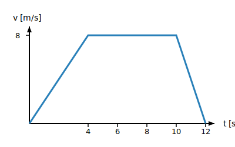

# Quiz — Temat 1: Kinematyka

Poniższe 10 pytań sprawdza znajomość całego tematu 1 (podtematy 1.1–1.6). Część pytań to pytania jednokrotnego wyboru (A–D), część to ocena prawda/fałsz kilku zdań, a część wymaga odczytu z wykresu — dokładnie tak, jak na etapie szkolnym konkursu zDolny Ślązak. Powodzenia!

**1.** Rowerzysta porusza się ruchem jednostajnym prostoliniowym z prędkością `5 m/s`. Jaką drogę przejedzie w ciągu `2 minut`?

- [ ] A. `10 m`
- [ ] B. `100 m`
- [ ] C. `300 m`
- [ ] D. `600 m`

**2.** Pasażer siedzący w jadącym po prostych torach pociągu upuszcza długopis, który spada prosto na podłogę wagonu (dokładnie pod miejscem, z którego spadł — względem podłogi wagonu). Obserwator stojący nieruchomo na peronie zobaczy, że tor lotu długopisu jest:

- [ ] A. taki sam jak dla pasażera — pionową linią prostą
- [ ] B. krzywą (łukiem), bo pociąg porusza się względem peronu
- [ ] C. poziomą linią prostą
- [ ] D. długopis w ogóle się nie porusza względem peronu

**3.** Rowerzysta rusza z miejsca (`v₀ = 0`) i porusza się ruchem jednostajnie przyspieszonym ze stałym przyspieszeniem `a = 2 m/s²`. Oceń prawdziwość poniższych zdań (P/F):

- [ ] A. Po upływie `1 sekundy` jego prędkość wynosi `2 m/s`.
- [ ] B. W ciągu pierwszych `3 sekund` ruchu rowerzysta przejechał `9 m`.
- [ ] C. Wartość przyspieszenia rowerzysty rośnie z upływem czasu.
- [ ] D. Po upływie `5 sekund` jego prędkość wynosi `10 m/s`.

**4.** Na wykresie poniżej przedstawiono zależność drogi od czasu s(t) dla pewnego ciała:

*Ilustracja własna — dokładny wykres do tego konkretnego zadania (nie znaleziono gotowego obrazka z tymi samymi liczbami).*

(odcinek `0–2 s`: droga rośnie liniowo od `0` do `20 m`; odcinek `2–6 s`: droga pozostaje stała na poziomie `20 m`)

W którym przedziale czasu prędkość ciała była równa zeru?

- [ ] A. `0–2 s`
- [ ] B. `2–6 s`
- [ ] C. Prędkość nigdy nie była równa zeru
- [ ] D. Nie da się tego stwierdzić na podstawie wykresu s(t)

**5.** Samochód zwiększa swoją prędkość jednostajnie od `10 m/s` do `25 m/s` w ciągu `5 sekund`. Jaka jest wartość przyspieszenia samochodu?

- [ ] A. `2 m/s²`
- [ ] B. `3 m/s²`
- [ ] C. `5 m/s²`
- [ ] D. `7,5 m/s²`

**6.** Oceń prawdziwość poniższych zdań dotyczących przeliczania jednostek (P/F):

- [ ] A. `54 km/h` to dokładnie `15 m/s`.
- [ ] B. `2 m/s` to `0,72 km/h`.
- [ ] C. `1500 m` to `1,5 km`.
- [ ] D. Pół godziny to `1800 sekund`.

**7.** Na wykresie poniżej przedstawiono zależność prędkości od czasu v(t) dla ciała poruszającego się przez `12 sekund`:

*Ilustracja własna — dokładny wykres do tego konkretnego zadania (nie znaleziono gotowego obrazka z tymi samymi liczbami).*

(odcinek `0–4 s`: prędkość rośnie liniowo od `0` do `8 m/s`; odcinek `4–10 s`: prędkość stała `8 m/s`; odcinek `10–12 s`: prędkość maleje liniowo do `0`)

Jaką całkowitą drogę przebyło to ciało w ciągu całych `12 sekund` ruchu?

- [ ] A. `48 m`
- [ ] B. `64 m`
- [ ] C. `72 m`
- [ ] D. `96 m`

**8.** Przyspieszenie pewnego ciała wynosi `500 cm/s²`. Ile to jest wyrażone w `m/s²`?

- [ ] A. `0,5 m/s²`
- [ ] B. `5 m/s²`
- [ ] C. `50 m/s²`
- [ ] D. `5000 m/s²`

**9.** Uczennica idzie do szkoły. Pierwsze `600 m` pokonuje w ciągu `10 minut` ruchem jednostajnym, a następnie ostatnie `200 m` przebiega w ciągu `1 minuty` (też w przybliżeniu ruchem jednostajnym, bo biegnie w stałym tempie). Oceń prawdziwość poniższych zdań (P/F):

- [ ] A. Prędkość uczennicy podczas chodu wynosiła `1 m/s`.
- [ ] B. Prędkość uczennicy podczas biegu była większa niż podczas chodu.
- [ ] C. Średnia prędkość na całej trasie (`800 m` w `11 minut`) wynosi około `1,2 m/s`.
- [ ] D. Cała droga pokonana przez uczennicę wynosi `900 m`.

**10.** Rowerzysta jadący z prędkością `12 m/s` zaczyna hamować ruchem jednostajnie opóźnionym i zatrzymuje się dokładnie po przejechaniu `18 m`. Jaka była wartość przyspieszenia (opóźnienia) podczas hamowania? (Wskazówka: skorzystaj ze wzoru $v^2 = v_0^2 - 2as$, gdzie `v` to prędkość końcowa, tutaj równa `0`).

- [ ] A. `2 m/s²`
- [ ] B. `3 m/s²`
- [ ] C. `4 m/s²`
- [ ] D. `6 m/s²`

[⬅ Powrót do spisu treści](1.0_kinematyka.md)
