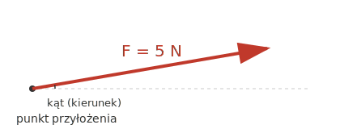

# 2.1. Siła jako wektor — wartość, kierunek, zwrot; pomiar siły

📚 *Zobacz na Khan Academy: [Przypomnienie wiadomości o siłach i o graficznym przedstawianiu sił](https://pl.khanacademy.org/science/high-school-physics/forces-and-newtons-laws-of-motion/introduction-to-forces-and-free-body-diagrams/a/forces-introduction-and-free-body-diagrams-ap1)*

Siła to oddziaływanie jednego ciała na drugie, które może zmienić prędkość ciała (jego wartość lub kierunek) albo je odkształcić (np. rozciągnąć sprężynę, zgnieść puszkę).

Siła jest **wektorem** i oznaczamy ją ze strzałką nad symbolem: $\vec{F}$ (zobacz temat 0.6, gdzie wprowadzamy ogólne rozróżnienie skalar/wektor, używane w całym tym materiale) — to znaczy, że aby ją w pełni opisać, potrzebujemy trzech informacji:

1. **Wartości (modułu)** — "jak mocno", np. 10 N. Mierzymy ją w **niutonach (N)**.
2. **Kierunku** — linii, wzdłuż której siła działa (np. pionowo, poziomo, pod kątem 30°).
3. **Zwrotu** — w którą stronę wzdłuż tego kierunku siła "ciągnie" lub "pcha" (np. w górę albo w dół).

Dodatkowo ważny jest **punkt przyłożenia** siły, czyli miejsce na ciele, w którym siła działa.

Siłę rysujemy jako **strzałkę**: długość strzałki odpowiada wartości (modułowi) siły $F = |\vec{F}|$ (im dłuższa, tym większa siła), kierunek strzałki to kierunek siły, a grot strzałki wskazuje zwrot. Zapis bez strzałki (samo $F$) oznacza więc tylko wartość siły — bez informacji o kierunku i zwrocie.

### Rysunek: wektor siły

*Strzałka pokazuje siłę $\vec{F}$ o wartości $F = 5\ \text{N}$: zaczyna się w punkcie przyłożenia, ma długość odpowiadającą wartości siły, biegnie pod pewnym kątem (kierunek) i wskazuje grotem w prawo-górę (zwrot).*

### Pomiar siły

Siłę mierzymy **siłomierzem (dynamometrem)**. Jego działanie opiera się na tym, że sprężyna wewnątrz rozciąga się tym bardziej, im większa siła na nią działa (o tym więcej w podrozdziale 2.2). Skala siłomierza jest wyskalowana w niutonach.

**Jednostka siły:** `1 N` to siła, która ciału o masie `1 kg` nadaje przyspieszenie `1 m/s²`. W jednostkach podstawowych SI: $1\ \text{N} = 1\ \text{kg} \cdot \text{m/s}^2$.

### Przykład

*Treść:* Uczeń zawiesił na siłomierzu odważnik i odczytał wynik `2,5 N`. Zapisz, jakie trzy elementy opisują tę siłę i podaj jej wartość w jednostkach podstawowych SI.

*Rozwiązanie:*

- Wartość siły: 2,5 N.
- Kierunek: pionowy (linka siłomierza wisi pionowo).
- Zwrot: w dół (odważnik ciągnie sprężynę siłomierza ku ziemi).
- Zamiana na jednostki podstawowe: $1\ \text{N} = 1\ \text{kg}\cdot\text{m/s}^2$, więc $2{,}5\ \text{N} = 2{,}5\ \text{kg}\cdot\text{m/s}^2$.

*Odpowiedź:* Siła ma wartość `2,5 N` (czyli `2,5 kg·m/s²`), kierunek pionowy i zwrot w dół.

### Ciekawostka: ile to jest "1 niuton" w praktyce?

1 N to naprawdę niewielka siła — z siłą bliską 1 N Ziemia przyciąga zwykłe jabłko o masie ok. 100 g (patrz temat 2.7: $F_g = m \cdot g \approx 0{,}1\ \text{kg} \cdot 9{,}81\ \text{m/s}^2 \approx 0{,}98\ \text{N}$). Nieprzypadkowo krąży (prawdopodobnie mocno uproszczona) historia o Newtonie i spadającym jabłku — niezależnie od tego, ile w niej prawdy, "ciężar jabłka" to niezła podpowiedź, jak sobie wyobrazić wartość 1 N.

### Zaskakujące pytanie: czym właściwie różni się "kierunek" od "zwrotu"?

W codziennym języku mówimy tylko "w którą stronę", a fizyka rozbija to na dwa osobne elementy — i nie jest to zbędna komplikacja. Wyobraź sobie prostą, poziomą drogę. To jest **kierunek** — jest jeden, poziomy, wzdłuż tej drogi. Ale po tej samej drodze można jechać w lewo albo w prawo — to są dwa różne **zwroty** tego samego kierunku. Dlatego dwie siły mogą mieć identyczny kierunek (np. obie "pionowe"), a mimo to być całkowicie różne w skutkach — jedna ciągnie do góry, druga w dół. Bez tego rozróżnienia nie da się poprawnie obliczyć siły wypadkowej, gdy siły mają przeciwne zwroty (zobacz podrozdział 2.4) — to nie fanaberia, a konieczność.

[⬅ Powrót do spisu treści](2.0_sily_i_dynamika.md)
