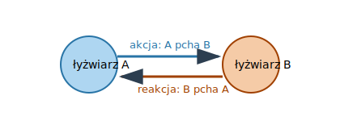

# 2.3. Trzy zasady dynamiki Newtona

📚 *Zobacz na Khan Academy: [Siły i prawa dynamiki Newtona](https://pl.khanacademy.org/science/physics/forces-newtons-laws)*

Izaak Newton sformułował trzy zasady, które opisują związek między siłami działającymi na ciało a jego ruchem.

### I zasada dynamiki (zasada bezwładności)

Jeżeli na ciało nie działają żadne siły albo działające siły się równoważą (wypadkowa sił $F_w = 0$), to ciało pozostaje w spoczynku lub porusza się ruchem jednostajnym prostoliniowym (ze stałą prędkością, po linii prostej).

Innymi słowy: ciało "samo z siebie" nie zmienia swojego stanu ruchu — potrzebuje do tego siły wypadkowej różnej od zera.

### II zasada dynamiki

Jeżeli na ciało działa niezerowa siła wypadkowa, to ciało porusza się ruchem zmiennym (z przyspieszeniem). Przyspieszenie ciała jest wprost proporcjonalne do siły wypadkowej i odwrotnie proporcjonalne do masy ciała:

$$\vec{F} = m\vec{a} \qquad \text{czyli} \qquad \vec{a} = \frac{\vec{F}}{m}$$

gdzie: $\vec{F}$ — siła wypadkowa (wektor) [N], $m$ — masa ciała (skalar) [kg], $\vec{a}$ — przyspieszenie (wektor) [m/s²].

Zwrot przyspieszenia jest zawsze zgodny ze zwrotem siły wypadkowej.

### III zasada dynamiki (zasada akcji i reakcji)

Jeżeli ciało A działa na ciało B pewną siłą (akcja), to ciało B działa na ciało A siłą o takiej samej wartości i kierunku, ale przeciwnym zwrocie (reakcja). Te dwie siły działają **zawsze na dwa różne ciała** (nigdy się nie równoważą, bo są przyłożone gdzie indziej!) i występują zawsze w parach — nie ma akcji bez reakcji.

### Rysunek: para akcja–reakcja (III zasada dynamiki)

*Gdy łyżwiarz A odpycha łyżwiarza B (siła akcji w prawo), to łyżwiarz B jednocześnie odpycha łyżwiarza A z taką samą siłą, ale w przeciwną stronę (siła reakcji w lewo). Obaj odjadą od siebie — to właśnie efekt III zasady dynamiki.*

### Częsty błąd: para akcja–reakcja to NIE to samo, co siły równoważące się!

To jedna z najczęstszych pułapek w całej dynamice. Rozważmy książkę leżącą na stole. Działają na nią dwie siły: ciężar $\vec{F_g}$ (w dół) i siła reakcji podłoża $\vec{N}$ (w górę) — mają tę samą wartość, więc się równoważą (książka nie przyspiesza, zgodnie z I zasadą dynamiki). Czy $\vec{F_g}$ i $\vec{N}$ to para akcja–reakcja z III zasady? **Nie!** $\vec{F_g}$ i $\vec{N}$ działają na **to samo ciało** (książkę), a para akcja–reakcja z definicji działa na **dwa różne ciała**. Prawdziwe pary akcja–reakcja w tej sytuacji wyglądają inaczej:

- Ziemia przyciąga książkę siłą $\vec{F_g}$ (w dół) ↔ książka przyciąga Ziemię siłą o tej samej wartości, ale skierowaną w górę (do książki) — ta druga siła działa na Ziemię, nie na książkę!
- Książka naciska na stół pewną siłą (w dół) ↔ stół naciska na książkę siłą $\vec{N}$ (w górę) — to jest właściwa para reakcji dla siły nacisku.

Krótko: siły równoważące się działają zawsze na **jedno** ciało (i mogą, ale nie muszą się równoważyć). Siły z pary akcja–reakcja działają zawsze na **dwa różne** ciała i mają zawsze taką samą wartość — to nie jest "równoważenie się", bo równoważenie dotyczy sił działających na to samo ciało.

### Przykład

*Treść:* Ciało o masie `4 kg` zostaje odepchnięte od ściany jedyną działającą na nie siłą poziomą o wartości `12 N` (skoro jest to jedyna siła pozioma, jest ona jednocześnie siłą wypadkową). Oblicz przyspieszenie ciała. Jaka siła reakcji działa na ścianę, od której ciało zostało odepchnięte?

*Rozwiązanie:*

Krok 1: Z II zasady dynamiki: $a = F/m = 12\ \text{N} / 4\ \text{kg} = 3\ \text{m/s}^2$.

Krok 2: Zgodnie z III zasadą dynamiki, siła, jaką ściana działa na ciało (`12 N`), ma swoją parę: ciało działa na ścianę siłą o tej samej wartości (`12 N`) i tym samym kierunku, ale przeciwnym zwrocie. Uwaga: III zasada łączy w parę konkretne siły oddziaływania między dwoma ciałami (tu: ściana↔ciało), a nie ogólną "siłę wypadkową" — działa to tutaj, bo siła od ściany jest jedyną siłą poziomą.

*Odpowiedź:* Przyspieszenie ciała wynosi `3 m/s²`. Siła reakcji (działająca na ścianę) ma wartość `12 N` i przeciwny zwrot do siły działającej na ciało.

### Ciekawostka: jak rakieta przyspiesza w pustce kosmicznej, gdzie nie ma od czego się odbić?

To pytanie zadaje sobie wielu ludzi: w powietrzu śmigło "odpycha się" od powietrza, koła samochodu — od drogi, a rakieta w kosmosie nie ma niczego wokół, od czego mogłaby się odepchnąć. Odpowiedź leży właśnie w III zasadzie dynamiki: rakieta nie musi odpychać się od otoczenia — wystarczy, że odpycha własne spaliny (wyrzuca je z dużą siłą i prędkością w jedną stronę), a spaliny — zgodnie z zasadą akcji i reakcji — odpychają rakietę z taką samą siłą w stronę przeciwną. Para akcja–reakcja działa tu między rakietą i spalinami, a nie między rakietą i "próżnią" — dlatego silniki rakietowe działają równie dobrze (a nawet lepiej) w kosmicznej pustce, jak w atmosferze.

[⬅ Powrót do spisu treści](2.0_sily_i_dynamika.md)
