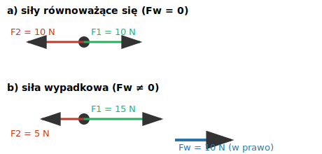

# 2.4. Siła wypadkowa i siły równoważące się

📚 *Zobacz na Khan Academy: [Siły wypadkowe (ćwiczenie)](https://pl.khanacademy.org/e/net-forces)*

Gdy na ciało działa więcej niż jedna siła, możemy je zastąpić jedną siłą o takim samym skutku — nazywamy ją **siłą wypadkową (Fw)**.

**Siły o tym samym kierunku:**

- Jeśli mają ten sam zwrot — ich wartości się dodają: Fw = F1 + F2.
- Jeśli mają przeciwne zwroty — wypadkowa to różnica ich wartości, a zwrot wypadkowej jest taki jak zwrot siły większej: Fw = |F1 − F2|.

**Siły równoważące się** to taki szczególny przypadek, gdy siła wypadkowa wynosi zero (Fw = 0 N). Wtedy — zgodnie z I zasadą dynamiki — ciało pozostaje w spoczynku albo porusza się ruchem jednostajnym prostoliniowym.

**Siły o różnych kierunkach** (np. prostopadłych) składamy geometrycznie — np. metodą równoległoboku, albo (dla kierunków prostopadłych) za pomocą twierdzenia Pitagorasa: Fw = √(F1² + F2²).

### Rysunek: siły równoważące się i siła wypadkowa

*a) Dwie siły o równych wartościach i przeciwnych zwrotach równoważą się — wypadkowa wynosi 0 N. b) Siły o różnych wartościach i przeciwnych zwrotach dają wypadkową równą różnicy wartości, skierowaną zgodnie z większą siłą.*

### Przykład

*Treść:* Na skrzynię działają dwie poziome siły o przeciwnych zwrotach: F1 = 45 N (w prawo) i F2 = 18 N (w lewo). Oblicz wartość i zwrot siły wypadkowej. Czy skrzynia może pozostawać w spoczynku?

*Rozwiązanie:*

Krok 1: Siły mają przeciwne zwroty, więc Fw = F1 − F2 = 45 N − 18 N = 27 N.

Krok 2: Zwrot wypadkowej jest zgodny z większą siłą, czyli w prawo.

Krok 3: Fw ≠ 0, więc zgodnie z I zasadą dynamiki skrzynia nie może pozostawać w spoczynku (o ile wcześniej się nie poruszała) — będzie się poruszać ruchem przyspieszonym w prawo.

*Odpowiedź:* Siła wypadkowa wynosi 27 N i jest skierowana w prawo. Skrzynia nie pozostanie w spoczynku — zacznie przyspieszać w kierunku większej siły.

### Ciekawostka: sonda, która leci od 1977 roku bez włączonych silników

Sondy Voyager 1 i 2 wystrzelono w 1977 roku. Ich silniki główne są wyłączone od dziesięcioleci, a mimo to sondy wciąż pędzą przez przestrzeń międzygwiazdową z niemal niezmienną prędkością (opuściły już Układ Słoneczny). Dlaczego? Daleko od planet i gwiazd siła wypadkowa działająca na sondę jest bliska zeru — grawitacja jest tam znikomo mała, a oporu ruchu po prostu nie ma (nie ma czego, co by "opierało"). Zgodnie z I zasadą dynamiki ciało, na które nie działa żadna siła wypadkowa, porusza się ruchem jednostajnym prostoliniowym — i właśnie to bez przerwy robi Voyager, bez zużycia ani grama paliwa na "napędzanie się".

### Zaskakujące pytanie: jeśli samochód jedzie ze stałą prędkością, to znaczy, że silnik nie działa żadną siłą?

Wcale nie — to jedna z bardziej mylących sytuacji w dynamice. Silnik samochodu jadącego stałą prędkością po prostej, płaskiej drodze wytwarza siłę napędową, i wcale nie jest ona zerowa (żeby ją wytworzyć, trzeba spalać paliwo). Prędkość jest jednak stała, bo ta siła napędowa dokładnie równoważy siły oporu (tarcie w mechanizmach i przede wszystkim opór powietrza) — wypadkowa wszystkich sił wynosi zero, więc zgodnie z I zasadą dynamiki auto nie przyspiesza. Stała prędkość nie oznacza więc braku sił — oznacza, że siły się równoważą.

[⬅ Powrót do spisu treści](2.0_sily_i_dynamika.md)
