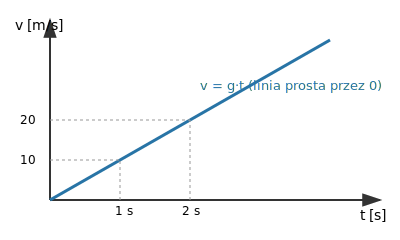

# 2.6. Spadek swobodny jako ruch jednostajnie przyspieszony

📚 *Zobacz na Khan Academy: [Przegląd wiadomości na temat spadku swobodnego](https://pl.khanacademy.org/science/ap-physics-1/ap-one-dimensional-motion/falling-objects-ap-physics/a/freefall-ap1)*

**Spadek swobodny** to ruch ciała pod wpływem wyłącznie siły ciężkości, przy pominięciu oporu powietrza (i innych sił). Jest to ruch **jednostajnie przyspieszony** — prędkość ciała rośnie równomiernie, a przyspieszenie jest stałe i równe **przyspieszeniu ziemskiemu g ≈ 9,81 m/s²** (w zadaniach szkolnych często zaokrąglane do g = 10 m/s²).

Ważna cecha spadku swobodnego: przy braku oporu powietrza **wszystkie ciała spadają z takim samym przyspieszeniem**, niezależnie od swojej masy! Kamień i piórko spadałyby jednakowo szybko, gdyby nie opór powietrza (który w rzeczywistości znacznie bardziej hamuje lekkie i "rozłożyste" piórko niż zwarty kamień).

Wzory dla spadku swobodnego (ciało startuje z prędkością początkową v0 = 0):

- prędkość w chwili t: **v = g·t**
- droga (wysokość spadku) w czasie t: **h = ½·g·t²**

### Wykres v(t) dla spadku swobodnego

*Wykres zależności prędkości od czasu w spadku swobodnym to linia prosta wychodząca z zera — prędkość rośnie równomiernie o ok. 10 m/s co każdą sekundę (przy g ≈ 10 m/s²). To potwierdza, że jest to ruch jednostajnie przyspieszony.*

### Przykład

*Treść:* Kamień spada swobodnie (bez prędkości początkowej) z wysokości wieży. Po 3 sekundach uderza o ziemię. Przyjmij g = 10 m/s². Oblicz prędkość kamienia w chwili uderzenia oraz wysokość wieży.

*Rozwiązanie:*

Krok 1: Prędkość w chwili uderzenia: v = g·t = 10 m/s² · 3 s = 30 m/s.

Krok 2: Wysokość wieży (droga spadku): h = ½·g·t² = ½ · 10 m/s² · (3 s)² = ½ · 10 · 9 = 45 m.

*Odpowiedź:* Kamień uderzył o ziemię z prędkością 30 m/s, a wysokość wieży wynosi 45 m.

### Ciekawostka: dlaczego astronauci na ISS są "w nieważkości", jeśli grawitacja tam działa niemal jak na Ziemi?

To jeden z największych fizycznych mitów popkultury. Na wysokości Międzynarodowej Stacji Kosmicznej (ISS), ok. 400 km nad Ziemią, przyspieszenie grawitacyjne wynosi ok. 90% wartości ziemskiej — to wcale nie jest "brak grawitacji"! Astronauci "unoszą się" wewnątrz stacji nie dlatego, że grawitacja zniknęła, ale dlatego, że **stacja i wszystko (i wszyscy) w niej są w nieustannym spadku swobodnym** — spadają ku Ziemi z takim samym przyspieszeniem, poruszając się jednocześnie bardzo szybko "w bok" (ok. 7,7 km/s), dzięki czemu wciąż "nie trafiają" w Ziemię i lecą po orbicie. Skoro stacja i astronauci spadają razem, z tym samym przyspieszeniem, astronauta nie naciska na podłogę stacji (i podłoga nie naciska na niego) — stąd wrażenie nieważkości, mimo w pełni działającej grawitacji.

### Ciekawostka: eksperyment z młotkiem i piórkiem na Księżycu

2 sierpnia 1971 roku dowódca misji Apollo 15, David Scott, przeprowadził na Księżycu eksperyment na żywo, przed kamerami telewizyjnymi: puścił jednocześnie z tej samej wysokości (ok. 1,6 m) metalowy młotek geologiczny (masa ok. 1,3 kg) i lekkie pióro sokoła (masa ok. 0,03 kg — ponad 40 razy mniej!). Na Księżycu nie ma atmosfery, a więc nie ma oporu powietrza — obydwa przedmioty spadły z takim samym przyspieszeniem i uderzyły o powierzchnię Księżyca w tym samym momencie. To spektakularne, "na żywo" potwierdzenie tego, o czym mówi ten podrozdział: w spadku swobodnym przyspieszenie nie zależy od masy ciała — a różnice, które widzimy na Ziemi (kamień kontra piórko), to wyłącznie skutek oporu powietrza.

[⬅ Powrót do spisu treści](2.0_sily_i_dynamika.md)
