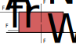

# Temat 2: Siły i dynamika

Dynamika to dział fizyki, który zajmuje się przyczynami ruchu — czyli tym, **dlaczego** ciała się poruszają, przyspieszają, zwalniają albo stoją w miejscu. Główną "bohaterką" dynamiki jest **siła**. W tym rozdziale poznasz, czym siła jest, jakie są jej rodzaje, jak działają na nią trzy słynne zasady Newtona oraz jak to wszystko połączyć z masą, bezwładnością i spadkiem swobodnym.

---

## 2.1. Siła jako wektor — wartość, kierunek, zwrot; pomiar siły

Siła to oddziaływanie jednego ciała na drugie, które może zmienić prędkość ciała (jego wartość lub kierunek) albo je odkształcić (np. rozciągnąć sprężynę, zgnieść puszkę).

Siła jest **wektorem** — to znaczy, że aby ją w pełni opisać, potrzebujemy trzech informacji:

1. **Wartości (modułu)** — "jak bardzo mocno", np. 10 N. Mierzymy ją w **niutonach (N)**.
2. **Kierunku** — linii, wzdłuż której siła działa (np. pionowo, poziomo, pod kątem 30°).
3. **Zwrotu** — w którą stronę wzdłuż tego kierunku siła "ciągnie" lub "pcha" (np. w górę albo w dół).

Dodatkowo ważny jest **punkt przyłożenia** siły, czyli miejsce na ciele, w którym siła działa.

Siłę rysujemy jako **strzałkę**: długość strzałki odpowiada wartości siły (im dłuższa, tym większa siła), kierunek strzałki to kierunek siły, a grot strzałki wskazuje zwrot.

### Rysunek: wektor siły

<svg viewBox="0 0 420 160" xmlns="http://www.w3.org/2000/svg" width="100%" style="max-width:500px">
  <defs>
    <marker id="grot1" markerWidth="10" markerHeight="10" refX="8" refY="3" orient="auto">
      <path d="M0,0 L9,3 L0,6 Z" fill="#c0392b"/>
    </marker>
  </defs>
  <line x1="40" y1="110" x2="380" y2="110" stroke="#ccc" stroke-width="1" stroke-dasharray="4,4"/>
  <circle cx="40" cy="110" r="4" fill="#333"/>
  <line x1="40" y1="110" x2="330" y2="60" stroke="#c0392b" stroke-width="4" marker-end="url(#grot1)"/>
  <text x="150" y="70" font-size="20" fill="#c0392b">F = 5 N</text>
  <text x="20" y="135" font-size="14" fill="#333">punkt przyłożenia</text>
  <path d="M 68 110 A 28 28 0 0 0 67.6 105.2" fill="none" stroke="#333" stroke-width="1.5"/>
  <text x="95" y="95" font-size="13" fill="#333">kąt (kierunek)</text>
</svg>

*Strzałka pokazuje siłę F = 5 N: zaczyna się w punkcie przyłożenia, ma długość odpowiadającą wartości siły, biegnie pod pewnym kątem (kierunek) i wskazuje grotem w prawo-górę (zwrot).*

### Pomiar siły

Siłę mierzymy **siłomierzem (dynamometrem)**. Jego działanie opiera się na tym, że sprężyna wewnątrz rozciąga się tym bardziej, im większa siła na nią działa (o tym więcej w podrozdziale 2.2). Skala siłomierza jest wyskalowana w niutonach.

**Jednostka siły:** 1 niuton (1 N) to siła, która ciału o masie 1 kg nadaje przyspieszenie 1 m/s². W jednostkach podstawowych SI: 1 N = 1 kg·m/s².

### Przykład

*Treść:* Uczeń zawiesił na siłomierzu odważnik i odczytał wynik 2,5 N. Zapisz, jakie trzy elementy opisują tę siłę i podaj jej wartość w jednostkach podstawowych SI.

*Rozwiązanie:*
- Wartość siły: 2,5 N.
- Kierunek: pionowy (linka siłomierza wisi pionowo).
- Zwrot: w dół (odważnik ciągnie sprężynę siłomierza ku ziemi).
- Zamiana na jednostki podstawowe: 1 N = 1 kg·m/s², więc 2,5 N = 2,5 kg·m/s².

*Odpowiedź:* Siła ma wartość 2,5 N (czyli 2,5 kg·m/s²), kierunek pionowy i zwrot w dół.

---

## 2.2. Rodzaje sił: ciężkości, nacisku, tarcia, sprężystości, oporu ruchu

W przyrodzie działa wiele rodzajów sił. Oto te najważniejsze na etapie szkolnym:

- **Siła ciężkości (Fg)** — przyciąganie ciała przez Ziemię, zawsze skierowana pionowo w dół, do środka Ziemi. Fg = m·g (patrz podrozdział 2.7).
- **Siła nacisku (siła docisku, N)** — siła, jaką ciało leżące na podłożu naciska na to podłoże (prostopadle do powierzchni). Gdy podłoże jest poziome i nie ma innych sił pionowych, siła nacisku ma tę samą wartość co ciężar ciała.
- **Siła reakcji podłoża (siła normalna)** — to siła, jaką podłoże "oddaje" ciału, zgodnie z III zasadą dynamiki (patrz 2.3); jest równa co do wartości sile nacisku, ale ma przeciwny zwrot (skierowana od podłoża, "do góry").
- **Siła tarcia (T)** — powstaje między dwiema stykającymi się powierzchniami i przeciwdziała (albo zapobiega) wzajemnemu przesuwaniu się tych powierzchni. Zwrot siły tarcia jest zawsze przeciwny do kierunku ruchu (albo do kierunku, w którym ciało "chciałoby" się poruszyć). Siła tarcia zależy od rodzaju powierzchni (współczynnika tarcia f) oraz od siły nacisku N: T = f·N. Nie zależy natomiast (w przybliżeniu) od wielkości powierzchni styku ani od prędkości poślizgu.
- **Siła sprężystości (Fs)** — pojawia się, gdy odkształcamy sprężynę, gumkę, pręt itp. Przeciwdziała odkształceniu i dąży do przywrócenia pierwotnego kształtu. Opisuje ją prawo Hooke'a: Fs = k·x, gdzie k to współczynnik sprężystości (stała sprężyny), a x to wydłużenie (odkształcenie).
- **Siła oporu ruchu (siła oporu ośrodka, np. powietrza lub wody)** — działa na ciało poruszające się w płynie (powietrzu, wodzie), zawsze przeciwnie do kierunku ruchu ciała względem ośrodka. Rośnie wraz z prędkością ciała — im szybciej się poruszamy, tym większy opór powietrza odczuwamy.

### Rysunek: siły działające na klocek leżący na stole (z tarciem)

*Źródło: [Maxmath12, „Friction diagram.svg”](https://commons.wikimedia.org/wiki/File:Friction_diagram.svg), domena publiczna (CC0 1.0)*

*Klocek ciągnięty siłą FA. Siła tarcia Ffr działa w przeciwną stronę, ciężar FW ciągnie w dół, a reakcja podłoża FN działa w górę (w tekście powyżej te same siły są oznaczone jako F, T, Fg i N).*

### Przykład

*Treść:* Klocek o ciężarze 20 N leży na poziomym stole. Współczynnik tarcia między klockiem a stołem wynosi f = 0,3. Oblicz wartość siły tarcia, jaką trzeba pokonać, aby klocek zaczął się przesuwać.

*Rozwiązanie:*
Krok 1: Klocek leży na poziomym stole, więc siła nacisku N na stół jest równa ciężarowi klocka: N = Fg = 20 N.
Krok 2: Siła tarcia T = f·N = 0,3 · 20 N = 6 N.

*Odpowiedź:* Siła tarcia wynosi 6 N — trzeba działać siłą większą niż 6 N, żeby klocek ruszył z miejsca.

---

## 2.3. Trzy zasady dynamiki Newtona

Izaak Newton sformułował trzy zasady, które opisują związek między siłami działającymi na ciało a jego ruchem.

### I zasada dynamiki (zasada bezwładności)

Jeżeli na ciało nie działają żadne siły albo działające siły się równoważą (wypadkowa sił = 0), to ciało pozostaje w spoczynku lub porusza się ruchem jednostajnym prostoliniowym (ze stałą prędkością, po linii prostej).

Innymi słowy: ciało "samo z siebie" nie zmienia swojego stanu ruchu — potrzebuje do tego siły wypadkowej różnej od zera.

### II zasada dynamiki

Jeżeli na ciało działa niezerowa siła wypadkowa, to ciało porusza się ruchem zmiennym (z przyspieszeniem). Przyspieszenie ciała jest wprost proporcjonalne do siły wypadkowej i odwrotnie proporcjonalne do masy ciała:

**F = m·a**, czyli **a = F/m**

gdzie: F — wartość siły wypadkowej [N], m — masa ciała [kg], a — przyspieszenie [m/s²].

Zwrot przyspieszenia jest zawsze zgodny ze zwrotem siły wypadkowej.

### III zasada dynamiki (zasada akcji i reakcji)

Jeżeli ciało A działa na ciało B pewną siłą (akcja), to ciało B działa na ciało A siłą o takiej samej wartości i kierunku, ale przeciwnym zwrocie (reakcja). Te dwie siły działają **zawsze na dwa różne ciała** (nigdy się nie równoważą, bo są przyłożone gdzie indziej!) i występują zawsze w parach — nie ma akcji bez reakcji.

### Rysunek: para akcja–reakcja (III zasada dynamiki)

<svg viewBox="0 0 420 160" xmlns="http://www.w3.org/2000/svg" width="100%" style="max-width:480px">
  <defs>
    <marker id="grot3" markerWidth="10" markerHeight="10" refX="8" refY="3" orient="auto">
      <path d="M0,0 L9,3 L0,6 Z" fill="#2c3e50"/>
    </marker>
  </defs>
  <circle cx="110" cy="80" r="35" fill="#aed6f1" stroke="#2874a6" stroke-width="2"/>
  <text x="90" y="85" font-size="14">łyżwiarz A</text>
  <circle cx="310" cy="80" r="35" fill="#f5cba7" stroke="#a04000" stroke-width="2"/>
  <text x="290" y="85" font-size="14">łyżwiarz B</text>

  <line x1="145" y1="70" x2="270" y2="70" stroke="#2874a6" stroke-width="3" marker-end="url(#grot3)"/>
  <text x="160" y="60" font-size="13" fill="#2874a6">akcja: A pcha B</text>

  <line x1="275" y1="95" x2="150" y2="95" stroke="#a04000" stroke-width="3" marker-end="url(#grot3)"/>
  <text x="170" y="115" font-size="13" fill="#a04000">reakcja: B pcha A</text>
</svg>

*Gdy łyżwiarz A odpycha łyżwiarza B (siła akcji w prawo), to łyżwiarz B jednocześnie odpycha łyżwiarza A z taką samą siłą, ale w przeciwną stronę (siła reakcji w lewo). Obaj odjadą od siebie — to właśnie efekt III zasady dynamiki.*

### Przykład

*Treść:* Ciało o masie 4 kg zostaje odepchnięte od ściany jedyną działającą na nie siłą poziomą o wartości 12 N (skoro jest to jedyna siła pozioma, jest ona jednocześnie siłą wypadkową). Oblicz przyspieszenie ciała. Jaka siła reakcji działa na ścianę, od której ciało zostało odepchnięte?

*Rozwiązanie:*
Krok 1: Z II zasady dynamiki: a = F/m = 12 N / 4 kg = 3 m/s².
Krok 2: Zgodnie z III zasadą dynamiki, siła, jaką ściana działa na ciało (12 N), ma swoją parę: ciało działa na ścianę siłą o tej samej wartości (12 N) i tym samym kierunku, ale przeciwnym zwrocie. Uwaga: III zasada łączy w parę konkretne siły oddziaływania między dwoma ciałami (tu: ściana↔ciało), a nie ogólną "siłę wypadkową" — działa to tutaj, bo siła od ściany jest jedyną siłą poziomą.

*Odpowiedź:* Przyspieszenie ciała wynosi 3 m/s². Siła reakcji (działająca na ścianę) ma wartość 12 N i przeciwny zwrot do siły działającej na ciało.

---

## 2.4. Siła wypadkowa i siły równoważące się

Gdy na ciało działa więcej niż jedna siła, możemy je zastąpić jedną siłą o takim samym skutku — nazywamy ją **siłą wypadkową (Fw)**.

**Siły o tym samym kierunku:**
- Jeśli mają ten sam zwrot — ich wartości się dodają: Fw = F1 + F2.
- Jeśli mają przeciwne zwroty — wypadkowa to różnica ich wartości, a zwrot wypadkowej jest taki jak zwrot siły większej: Fw = |F1 − F2|.

**Siły równoważące się** to taki szczególny przypadek, gdy siła wypadkowa wynosi zero (Fw = 0 N). Wtedy — zgodnie z I zasadą dynamiki — ciało pozostaje w spoczynku albo porusza się ruchem jednostajnym prostoliniowym.

**Siły o różnych kierunkach** (np. prostopadłych) składamy geometrycznie — np. metodą równoległoboku, albo (dla kierunków prostopadłych) za pomocą twierdzenia Pitagorasa: Fw = √(F1² + F2²).

### Rysunek: siły równoważące się i siła wypadkowa

<svg viewBox="0 0 460 220" xmlns="http://www.w3.org/2000/svg" width="100%" style="max-width:520px">
  <defs>
    <marker id="grot4" markerWidth="10" markerHeight="10" refX="8" refY="3" orient="auto">
      <path d="M0,0 L9,3 L0,6 Z" fill="#333"/>
    </marker>
  </defs>
  <text x="10" y="20" font-size="14" font-weight="bold">a) siły równoważące się (Fw = 0)</text>
  <circle cx="120" cy="60" r="8" fill="#333"/>
  <line x1="120" y1="60" x2="200" y2="60" stroke="#27ae60" stroke-width="3" marker-end="url(#grot4)"/>
  <text x="130" y="50" font-size="13" fill="#27ae60">F1 = 10 N</text>
  <line x1="120" y1="60" x2="40" y2="60" stroke="#c0392b" stroke-width="3" marker-end="url(#grot4)"/>
  <text x="15" y="50" font-size="13" fill="#c0392b">F2 = 10 N</text>

  <text x="10" y="130" font-size="14" font-weight="bold">b) siła wypadkowa (Fw ≠ 0)</text>
  <circle cx="120" cy="170" r="8" fill="#333"/>
  <line x1="120" y1="170" x2="230" y2="170" stroke="#27ae60" stroke-width="3" marker-end="url(#grot4)"/>
  <text x="130" y="160" font-size="13" fill="#27ae60">F1 = 15 N</text>
  <line x1="120" y1="170" x2="60" y2="170" stroke="#c0392b" stroke-width="3" marker-end="url(#grot4)"/>
  <text x="15" y="195" font-size="13" fill="#c0392b">F2 = 5 N</text>
  <line x1="250" y1="200" x2="330" y2="200" stroke="#2874a6" stroke-width="4" marker-end="url(#grot4)"/>
  <text x="255" y="215" font-size="13" fill="#2874a6">Fw = 10 N (w prawo)</text>
</svg>

*a) Dwie siły o równych wartościach i przeciwnych zwrotach równoważą się — wypadkowa wynosi 0 N. b) Siły o różnych wartościach i przeciwnych zwrotach dają wypadkową równą różnicy wartości, skierowaną zgodnie z większą siłą.*

### Przykład

*Treść:* Na skrzynię działają dwie poziome siły o przeciwnych zwrotach: F1 = 45 N (w prawo) i F2 = 18 N (w lewo). Oblicz wartość i zwrot siły wypadkowej. Czy skrzynia może pozostawać w spoczynku?

*Rozwiązanie:*
Krok 1: Siły mają przeciwne zwroty, więc Fw = F1 − F2 = 45 N − 18 N = 27 N.
Krok 2: Zwrot wypadkowej jest zgodny z większą siłą, czyli w prawo.
Krok 3: Fw ≠ 0, więc zgodnie z I zasadą dynamiki skrzynia nie może pozostawać w spoczynku (o ile wcześniej się nie poruszała) — będzie się poruszać ruchem przyspieszonym w prawo.

*Odpowiedź:* Siła wypadkowa wynosi 27 N i jest skierowana w prawo. Skrzynia nie pozostanie w spoczynku — zacznie przyspieszać w kierunku większej siły.

---

## 2.5. Masa a bezwładność ciał

**Bezwładność** to właściwość każdego ciała polegająca na tym, że "opiera się" ono zmianom swojej prędkości — czyli trudno je rozpędzić, zatrzymać albo zmienić kierunek jego ruchu. To właśnie dzięki bezwładności obowiązuje I zasada dynamiki: ciało, na które nie działa żadna siła wypadkowa, "samo z siebie" nie zmieni swojego ruchu.

**Masa** jest miarą bezwładności ciała. Im większa masa ciała, tym trudniej zmienić jego prędkość — potrzeba do tego większej siły (patrz II zasada dynamiki: a = F/m — przy tej samej sile, większa masa oznacza mniejsze przyspieszenie).

Dlatego cięższy wózek sklepowy trudniej rozpędzić i trudniej zatrzymać niż pusty — nie dlatego, że działa na niego większe tarcie (choć i to ma znaczenie), ale dlatego, że ma większą masę, a więc większą bezwładność.

Bezwładność odczuwamy też np. w samochodzie: gdy kierowca gwałtownie hamuje, nasze ciało "chce" dalej poruszać się do przodu z tą samą prędkością — dlatego wpycha nas w pasy bezpieczeństwa.

Ważne rozróżnienie: **masa** ciała jest wielkością stałą (nie zależy od miejsca we wszechświecie), natomiast **ciężar** (czyli siła ciężkości działająca na ciało) zależy od przyspieszenia grawitacyjnego w danym miejscu — dlatego to samo ciało ma inny ciężar na Ziemi, a inny na Księżycu, choć jego masa (i bezwładność) się nie zmienia.

### Przykład

*Treść:* Dwie kulki, o masach 1 kg i 5 kg, popychamy tą samą siłą 10 N. Która kulka uzyska większe przyspieszenie i o ile razy większe?

*Rozwiązanie:*
Krok 1: Przyspieszenie kulki 1: a1 = F/m1 = 10 N / 1 kg = 10 m/s².
Krok 2: Przyspieszenie kulki 2: a2 = F/m2 = 10 N / 5 kg = 2 m/s².
Krok 3: Porównanie: a1/a2 = 10/2 = 5.

*Odpowiedź:* Lżejsza kulka (1 kg) uzyska przyspieszenie 5 razy większe niż kulka o masie 5 kg — ponieważ ma mniejszą bezwładność.

---

## 2.6. Spadek swobodny jako ruch jednostajnie przyspieszony

**Spadek swobodny** to ruch ciała pod wpływem wyłącznie siły ciężkości, przy pominięciu oporu powietrza (i innych sił). Jest to ruch **jednostajnie przyspieszony** — prędkość ciała rośnie równomiernie, a przyspieszenie jest stałe i równe **przyspieszeniu ziemskiemu g ≈ 9,81 m/s²** (w zadaniach szkolnych często zaokrąglane do g = 10 m/s²).

Ważna cecha spadku swobodnego: przy braku oporu powietrza **wszystkie ciała spadają z takim samym przyspieszeniem**, niezależnie od swojej masy! Kamień i piórko spadałyby jednakowo szybko, gdyby nie opór powietrza (który w rzeczywistości znacznie bardziej hamuje lekkie i "rozłożyste" piórko niż zwarty kamień).

Wzory dla spadku swobodnego (ciało startuje z prędkością początkową v0 = 0):

- prędkość w chwili t: **v = g·t**
- droga (wysokość spadku) w czasie t: **h = ½·g·t²**

### Wykres v(t) dla spadku swobodnego

<svg viewBox="0 0 400 240" xmlns="http://www.w3.org/2000/svg" width="100%" style="max-width:440px">
  <defs>
    <marker id="grot5" markerWidth="10" markerHeight="10" refX="8" refY="3" orient="auto">
      <path d="M0,0 L9,3 L0,6 Z" fill="#333"/>
    </marker>
  </defs>
  <line x1="50" y1="200" x2="380" y2="200" stroke="#333" stroke-width="2" marker-end="url(#grot5)"/>
  <text x="360" y="220" font-size="14">t [s]</text>
  <line x1="50" y1="200" x2="50" y2="20" stroke="#333" stroke-width="2" marker-end="url(#grot5)"/>
  <text x="15" y="30" font-size="14">v [m/s]</text>

  <line x1="50" y1="200" x2="330" y2="40" stroke="#2874a6" stroke-width="3"/>

  <line x1="50" y1="200" x2="50" y2="200" stroke="#999" stroke-dasharray="3,3"/>
  <line x1="120" y1="200" x2="120" y2="160" stroke="#999" stroke-dasharray="3,3"/>
  <line x1="50" y1="160" x2="120" y2="160" stroke="#999" stroke-dasharray="3,3"/>
  <text x="115" y="215" font-size="12">1 s</text>
  <text x="20" y="164" font-size="12">10</text>

  <line x1="190" y1="200" x2="190" y2="120" stroke="#999" stroke-dasharray="3,3"/>
  <line x1="50" y1="120" x2="190" y2="120" stroke="#999" stroke-dasharray="3,3"/>
  <text x="182" y="215" font-size="12">2 s</text>
  <text x="20" y="124" font-size="12">20</text>

  <text x="200" y="90" font-size="13" fill="#2874a6">v = g·t (linia prosta przez 0)</text>
</svg>

*Wykres zależności prędkości od czasu w spadku swobodnym to linia prosta wychodząca z zera — prędkość rośnie równomiernie o ok. 10 m/s co każdą sekundę (przy g ≈ 10 m/s²). To potwierdza, że jest to ruch jednostajnie przyspieszony.*

### Przykład

*Treść:* Kamień spada swobodnie (bez prędkości początkowej) z wysokości wieży. Po 3 sekundach uderza o ziemię. Przyjmij g = 10 m/s². Oblicz prędkość kamienia w chwili uderzenia oraz wysokość wieży.

*Rozwiązanie:*
Krok 1: Prędkość w chwili uderzenia: v = g·t = 10 m/s² · 3 s = 30 m/s.
Krok 2: Wysokość wieży (droga spadku): h = ½·g·t² = ½ · 10 m/s² · (3 s)² = ½ · 10 · 9 = 45 m.

*Odpowiedź:* Kamień uderzył o ziemię z prędkością 30 m/s, a wysokość wieży wynosi 45 m.

---

## 2.7. Siła ciężkości i jej związek z masą i przyspieszeniem grawitacyjnym

**Siła ciężkości (ciężar ciała, Fg)** to siła, z jaką Ziemia przyciąga dane ciało. Jest skierowana zawsze pionowo w dół (do środka Ziemi) i oblicza się ją wzorem:

**Fg = m·g**

gdzie: m — masa ciała [kg], g — przyspieszenie grawitacyjne (dla Ziemi ok. 9,81 m/s², w zadaniach szkolnych zwykle 10 m/s²), Fg — ciężar ciała [N].

Warto zapamiętać różnicę: **masa** to ile "materii" jest w ciele — mierzymy ją w kilogramach i nie zmienia się ona w zależności od miejsca. **Ciężar** to siła, z jaką ciało jest przyciągane przez planetę — mierzymy ją w niutonach, i zależy ona od przyspieszenia grawitacyjnego danego miejsca (np. na Księżycu g jest około 6 razy mniejsze niż na Ziemi, więc ten sam przedmiot będzie tam ważył 6 razy mniej, mimo tej samej masy).

Zgodnie z III zasadą dynamiki, jeśli Ziemia przyciąga ciało siłą Fg, to ciało przyciąga Ziemię siłą o takiej samej wartości, ale przeciwnym zwrocie (skierowaną "w górę", do ciała) — tyle że ze względu na ogromną masę Ziemi, efekt tego przyciągania na ruch Ziemi jest zupełnie niezauważalny.

### Przykład

*Treść:* Plecak ucznia ma masę 4 kg. Oblicz jego ciężar na Ziemi (g = 10 m/s²) oraz jaki byłby jego ciężar na Księżycu, gdzie przyspieszenie grawitacyjne wynosi ok. 1,6 m/s².

*Rozwiązanie:*
Krok 1: Ciężar na Ziemi: Fg(Ziemia) = m·g = 4 kg · 10 m/s² = 40 N.
Krok 2: Ciężar na Księżycu: Fg(Księżyc) = m·g(Księżyc) = 4 kg · 1,6 m/s² = 6,4 N.
Krok 3: Masa plecaka pozostaje taka sama w obu miejscach — 4 kg.

*Odpowiedź:* Na Ziemi plecak waży 40 N, a na Księżycu tylko 6,4 N, choć jego masa (4 kg) się nie zmienia.

---

## 2.8. Doświadczenia związane z zasadami dynamiki

Zasady dynamiki można łatwo zaobserwować w prostych, domowych doświadczeniach:

**Doświadczenie 1 — I zasada dynamiki (bezwładność):** Postaw na kartce papieru szklankę. Szybko i zdecydowanie pociągnij kartkę poziomo. Szklanka pozostanie prawie w miejscu (dzięki bezwładności i małemu tarciu między kartką a szklanką), mimo że kartka spod niej zniknęła. Gdybyś ciągnął kartkę powoli, szklanka przesunęłaby się razem z nią (bo tarcie zdążyłoby przekazać jej siłę).

**Doświadczenie 2 — II zasada dynamiki (F = m·a):** Weź dwa wózki (lub zabawki na kółkach) o różnej masie i pociągnij oba tą samą siłą (np. za pomocą tej samej gumki rozciągniętej o tyle samo). Wózek lżejszy przyspieszy wyraźnie bardziej niż cięższy — to bezpośrednie potwierdzenie, że przy tej samej sile przyspieszenie zależy od masy (a = F/m).

**Doświadczenie 3 — III zasada dynamiki (akcja–reakcja):** Dwie osoby na deskorolkach (lub łyżwach) stają naprzeciw siebie i jedna odpycha drugą. Obie osoby odjadą w przeciwne strony — nawet jeśli jedna z nich "tylko się broniła", a nie odpychała aktywnie. To pokazuje, że siła akcji i reakcji działają zawsze parami, niezależnie od tego, kto "zaczął".

**Doświadczenie 4 — siła sprężystości (prawo Hooke'a):** Zawieś na sprężynie kolejno różne odważniki i za każdym razem zmierz wydłużenie sprężyny linijką. Zauważysz, że podwojenie masy odważnika (czyli podwojenie siły) powoduje w przybliżeniu podwojenie wydłużenia sprężyny — to potwierdza wzór Fs = k·x.

**Doświadczenie 5 — spadek swobodny i opór powietrza:** Upuść jednocześnie z tej samej wysokości kartkę papieru rozłożoną płasko oraz taką samą kartkę zgniecioną w kulkę. Kulka spadnie znacznie szybciej — mimo identycznej masy obu kartek! To pokazuje, że o różnicy w czasie spadania decyduje nie masa, lecz opór powietrza (kartka rozłożona ma większą powierzchnię, więc większy opór).

### Przykład

*Treść:* W doświadczeniu z wózkami (Doświadczenie 2) wózek A ma masę 2 kg, a wózek B masę 8 kg. Oba ciągniemy tą samą siłą 4 N. Oblicz przyspieszenia obu wózków i wyjaśnij, o ile razy któryś z nich będzie się poruszał "żwawiej".

*Rozwiązanie:*
Krok 1: Przyspieszenie wózka A: aA = F/mA = 4 N / 2 kg = 2 m/s².
Krok 2: Przyspieszenie wózka B: aB = F/mB = 4 N / 8 kg = 0,5 m/s².
Krok 3: aA / aB = 2 / 0,5 = 4.

*Odpowiedź:* Wózek A przyspiesza 4 razy szybciej niż wózek B, mimo że działa na nie ta sama siła — bo ma 4 razy mniejszą masę (a więc mniejszą bezwładność).

---

## Quiz

Poniższy quiz sprawdza Twoją wiedzę z całego rozdziału. Staraj się rozwiązywać zadania samodzielnie, zanim zajrzysz do odpowiedzi!

**1.** Które z poniższych trzech wielkości opisują w pełni siłę jako wektor?
- [ ] A. Masa, prędkość, czas.
- [ ] B. Wartość, kierunek, zwrot.
- [ ] C. Ciężar, przyspieszenie, tarcie.
- [ ] D. Punkt przyłożenia, jednostka, kolor strzałki.

**2.** Klocek o ciężarze 30 N leży na poziomym stole. Współczynnik tarcia między klockiem a stołem wynosi f = 0,25. Oblicz wartość siły tarcia, którą trzeba pokonać, by klocek zaczął się ślizgać.

**3.** Oceń prawdziwość poniższych stwierdzeń o sile tarcia (P — prawda, F — fałsz):
- [ ] A. Siła tarcia zawsze działa zgodnie ze zwrotem ruchu ciała.
- [ ] B. Siła tarcia rośnie, gdy zwiększamy siłę nacisku ciała na podłoże.
- [ ] C. Wartość siły tarcia (w przybliżeniu) nie zależy od pola powierzchni styku dwóch ciał.

**4.** Na sanki o masie 20 kg działa pozioma siła wypadkowa 8 N. Oblicz przyspieszenie sanek.

**5.** Piłkarz kopie piłkę, działając na nią siłą 50 N. Zgodnie z III zasadą dynamiki Newtona, jaka siła działa na stopę piłkarza ze strony piłki?
- [ ] A. Siła o wartości 50 N, o tym samym kierunku i tym samym zwrocie.
- [ ] B. Siła o wartości 50 N, o tym samym kierunku i przeciwnym zwrocie.
- [ ] C. Siła o wartości 0 N, bo piłka jest dużo lżejsza od piłkarza.
- [ ] D. Siła zależna wyłącznie od masy piłki, o nieznanej wartości.

**6.** Na skrzynię działają dwie poziome, przeciwnie skierowane siły: F1 = 36 N oraz F2 = 21 N. Oblicz wartość i wskaż zwrot siły wypadkowej (przyjmij, że F1 jest skierowana w prawo).

**7.** Oceń prawdziwość poniższych stwierdzeń o masie i bezwładności (P — prawda, F — fałsz):
- [ ] A. Im większa masa ciała, tym większa jego bezwładność.
- [ ] B. Ciężar ciała jest wielkością stałą, niezależną od miejsca we wszechświecie.
- [ ] C. Przy tej samej sile działającej na dwa ciała, ciało o mniejszej masie uzyska większe przyspieszenie.

**8.** Kamień spada swobodnie (bez prędkości początkowej i bez oporu powietrza) przez 4 sekundy. Przyjmij g = 10 m/s². Oblicz prędkość kamienia w chwili, gdy dotyka ziemi, oraz drogę, jaką przebył w czasie spadania.

**9.** Rakieta kosmiczna o masie 500 kg (bez paliwa) ma na Ziemi ciężar 5000 N. Jaki byłby ciężar tej samej rakiety na planecie, na której przyspieszenie grawitacyjne wynosi 4 m/s²?
- [ ] A. 500 N.
- [ ] B. 2000 N.
- [ ] C. 5000 N — ciężar się nie zmienia.
- [ ] D. 12500 N.

**10.** Uczennica przygotowała doświadczenie: postawiła szklankę z wodą na sztywnej kartce leżącej na stole, a następnie gwałtownie i szybko wysunęła kartkę spod szklanki poziomym ruchem. Które zjawisko fizyczne najlepiej tłumaczy, dlaczego szklanka pozostała niemal w tym samym miejscu?
- [ ] A. III zasada dynamiki — akcja i reakcja.
- [ ] B. Bezwładność szklanki (I zasada dynamiki) w połączeniu z krótkim czasem działania siły tarcia.
- [ ] C. Duża siła sprężystości kartki papieru.
- [ ] D. Zjawisko oporu powietrza działające na szklankę.
