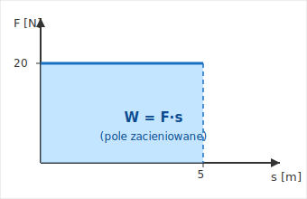

# 3.1. Praca mechaniczna i moc

📚 *Zobacz na Khan Academy: [Czym są energia i praca?](https://pl.khanacademy.org/science/physics/work-and-energy/work-and-energy-tutorial/a/what-is-work)*

📚 *Zobacz na Khan Academy: [Co to jest moc?](https://pl.khanacademy.org/science/physics/work-and-energy/work-and-energy-tutorial/a/what-is-power)*

### Czym jest praca mechaniczna?

W fizyce praca jest wykonywana tylko wtedy, gdy **na ciało działa siła** i **ciało pod wpływem tej siły przemieszcza się**, a siła (a przynajmniej jej część) ma zwrot zgodny z kierunkiem tego przemieszczenia.

To ważne zastrzeżenie! Jeśli pchasz ciężką szafę z całych sił, a ona ani drgnie — z punktu widzenia fizyki **nie wykonujesz żadnej pracy** (choć Twoje mięśnie się zmęczą). Podobnie tragarz niosący walizkę poziomo, idąc równym krokiem, nie wykonuje pracy nad walizką w kierunku pionowym (siła nacisku ręki jest pionowa, a przemieszczenie poziome) — pracę wykonuje jedynie siła, która pcha go do przodu.

### Ciekawostka: dwa sposoby na zerową pracę

> **Dziwne pytanie:** Trzymam bardzo ciężką walizkę w wyciągniętej ręce przez cały kwadrans, aż bolą mnie mięśnie. Czy to na pewno "zerowa praca"?

Z punktu widzenia fizyki mechanicznej — tak, dokładnie zero. We wzorze $W = F \cdot s$ droga $s$, jaką pokonuje walizka, wynosi `0` (nie zmienia ani wysokości, ani położenia), więc niezależnie od tego, jak wielką siłą ją podpierasz: $W = F \cdot 0 = 0\ \text{J}$.

To zupełnie inny "sposób" na zerową pracę niż w przykładzie tragarza opisanym wyżej: tam droga $s$ nie była zerowa (tragarz idzie do przodu), tylko siła $F$ (skierowana w górę, żeby przeciwważyć ciężar walizki) była prostopadła do przemieszczenia (poziomego) — a praca zależy tylko od tej części siły, która działa **wzdłuż** kierunku przemieszczenia.

Zmęczenie mięśni nie jest więc sprzeczne z fizyką — to inny rodzaj "kosztu". Żeby utrzymać stałe napięcie, mięśnie muszą bez przerwy zużywać energię chemiczną (z pokarmu) na mikroskopowe, powtarzające się skróty i drgania włókien mięśniowych. Ta energia zamienia się głównie w ciepło (dlatego się pocimy, trzymając coś długo w tej samej pozycji) — ale w sensie mechanicznym, bez przemieszczenia walizki, żadna praca nad nią nie została wykonana.

### Wzór na pracę

Gdy siła $F$ działa zgodnie z kierunkiem przemieszczenia $s$ (albo dokładnie przeciwnie do niego), pracę liczymy ze wzoru:

$$W = F \cdot s$$

**Uwaga:** praca `W` jest wielkością SKALARNĄ, mimo że oblicza się ją z dwóch wektorów — siły $\vec{F}$ i przemieszczenia. We wzorze $W = F \cdot s$ używamy tylko ich WARTOŚCI (a konkretnie: wartości składowej siły równoległej do przemieszczenia — dlatego wzór działa tylko, gdy siła jest równoległa albo przeciwna do kierunku ruchu, zobacz zastrzeżenie wyżej). Zobacz temat 0.6.

gdzie:

- $W$ — praca mechaniczna (skalar), jednostka: dżul (J)
- $F$ — siła (wektor — tu użyta wartość), jednostka: niuton (N)
- $s$ — droga (skalar), jednostka: metr (m)

1 dżul to praca wykonana przez siłę `1 N` na drodze `1 m`: $1\ \text{J} = 1\ \text{N} \cdot \text{m}$.

Jeśli siła jest skierowana *przeciwnie* do ruchu (np. tarcie hamujące sanki), praca tej siły jest ujemna — siła "zabiera" energię ciału, zamiast mu jej przekazywać.

### Praca z wykresu F(s)

Bardzo lubianym typem zadania konkursowego jest odczytanie pracy z wykresu zależności siły od drogi. Wtedy **praca jest równa polu powierzchni pod wykresem** $F(s)$ (między wykresem a osią $s$).

*Rysunek 1. Gdy siła $F$ jest stała, wykres $F(s)$ jest poziomą linią, a praca to pole prostokąta pod nią: $W = 20\ \text{N} \cdot 5\ \text{m} = 100\ \text{J}$.*

Jeśli wykres nie jest prostokątem, tylko np. trójkątem albo trapezem (siła rośnie lub maleje w miarę drogi), pole liczymy jak pole odpowiedniej figury geometrycznej — to właśnie lubi sprawdzać zDolny Ślązak.

### Moc

Moc mówi nam, **jak szybko** wykonywana jest praca — czy silnik "śpieszy się", czy nie.

$$P = \frac{W}{t}$$

gdzie:

- $P$ — moc (skalar), jednostka: wat (W)
- $W$ — praca (skalar), jednostka: dżul (J)
- $t$ — czas (skalar), jednostka: sekunda (s)

1 wat to moc urządzenia, które w ciągu 1 sekundy wykonuje pracę 1 dżula: $1\ \text{W} = 1\ \text{J/s}$.

W praktyce spotkasz też jednostki pochodne: $1\ \text{kW} = 1000\ \text{W}$, oraz jednostkę pracy/energii często używaną na rachunkach za prąd: `1 kWh` (kilowatogodzina) = praca wykonana przez urządzenie o mocy `1 kW` w ciągu 1 godziny = $3\,600\,000\ \text{J}$.

### Ciekawostka: skąd się wzięła jednostka "koń mechaniczny" i jaką moc ma człowiek?

Nazwa jednostki wat (W) pochodzi od szkockiego inżyniera **Jamesa Watta**, twórcy udoskonalonej maszyny parowej. Watt reklamował swoje maszyny, porównując ich moc do konia pracującego w kopalni — i tak powstała potoczna jednostka **koń mechaniczny (KM)**, w przybliżeniu równa `735 W`. Do dziś moc samochodowych silników bywa podawana w koniach mechanicznych, choć jednostką układu SI jest wat.

A jaką moc może wytworzyć człowiek? Wytrenowany rowerzysta jest w stanie utrzymać moc rzędu `150-300 W` przez dłuższy czas (to porównywalne z mocą suszarki do włosów na niskim biegu), a w krótkim, maksymalnym wysiłku (np. sprincie albo wyskoku) sportowiec może chwilowo wytworzyć nawet `1000-2000 W` — czyli tyle, co domowy czajnik elektryczny! Różnica jest tak duża, bo moc mierzy *tempo* wykonywania pracy, a maksymalny wysiłek można utrzymać tylko przez kilka sekund, zanim mięśnie "zadłużą się" energetycznie.

### Przykład

**Treść zadania:** Kurier ciągnie wózek z paczkami siłą `40 N`, zgodną z kierunkiem ruchu, na odcinku `15 m`. Cała czynność zajęła mu `20 sekund`. Oblicz pracę wykonaną przez kuriera oraz moc, z jaką pracował.

**Rozwiązanie krok po kroku:**

1. Dane: $F = 40\ \text{N}$, $s = 15\ \text{m}$, $t = 20\ \text{s}$.
2. Obliczamy pracę: $W = F \cdot s = 40\ \text{N} \cdot 15\ \text{m} = 600\ \text{J}$.
3. Obliczamy moc: $P = W / t = 600\ \text{J} / 20\ \text{s} = 30\ \text{W}$.

**Odpowiedź:** Kurier wykonał pracę `600 J`, pracując ze średnią mocą `30 W`.

[⬅ Powrót do spisu treści](3.0_praca_moc_energia.md)
