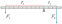
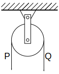
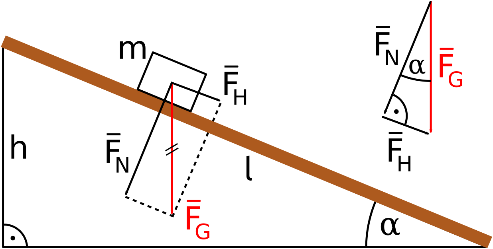

# 3.2. Maszyny proste: dźwignia jedno- i dwustronna, bloki, kołowrotek, równia pochyła

📚 *Zobacz na Khan Academy: [Dźwignia](https://pl.khanacademy.org/science/physics/discoveries/simple-machines-explorations/a/lever)*
📚 *Zobacz na Khan Academy: [Krążek liniowy](https://pl.khanacademy.org/science/physics/discoveries/simple-machines-explorations/a/pulleys)*
📚 *Zobacz na Khan Academy: [Co to jest równia pochyła?](https://pl.khanacademy.org/science/physics/forces-newtons-laws/inclined-planes-friction/a/what-are-inclines)*

### Złota reguła mechaniki

Zanim omówimy poszczególne maszyny proste, poznaj najważniejszą zasadę tego rozdziału — **złotą regułę mechaniki**:

> Żadna maszyna prosta nie daje "zysku energetycznego". Ile razy maszyna zmniejsza potrzebną siłę, tyle samo razy trzeba tę siłę przyłożyć na dłuższej drodze — i odwrotnie. Praca wykonana przy użyciu maszyny prostej (pomijając tarcie) jest taka sama, jak bez niej.

To bezpośrednia konsekwencja wzoru W = F · s: skoro praca ma być taka sama, a zmniejszamy F, to musimy proporcjonalnie zwiększyć s.

### Dźwignia jednostronna i dwustronna

**Dźwignia** to sztywny pręt (belka) mogący obracać się wokół punktu podparcia zwanego **osią obrotu** (albo punktem podparcia).

- **Dźwignia dwustronna** — punkt podparcia znajduje się *między* punktami przyłożenia obu sił (np. huśtawka, waga szalkowa, nożyczki, huśtawka na placu zabaw).
- **Dźwignia jednostronna** — punkt podparcia znajduje się *na końcu*, a obie siły działają po tej samej stronie osi obrotu (np. taczka, dziadek do orzechów, otwieracz do butelek).

Warunkiem równowagi dźwigni (obu rodzajów) jest równość **momentów sił** — czyli iloczynów siły i długości jej ramienia (odległości od osi obrotu, mierzonej prostopadle do kierunku siły):

**F₁ · r₁ = F₂ · r₂**

gdzie r₁, r₂ to ramiona sił F₁ i F₂.

*Rysunek 2. Dźwignia dwustronna — oś obrotu leży między punktami przyłożenia sił F₁ i F₂ (tu oznaczonych jako F₁, F₂, a ramiona jako r₁, r₂). Krótsze ramię wymaga większej siły: F₁ · r₁ = F₂ · r₂.*
*Źródło: [File:FirstClassLever.svg](https://commons.wikimedia.org/wiki/File:FirstClassLever.svg), autor: Mpfiz, domena publiczna (Wikimedia Commons).*

Im krótsze ramię, tym większa musi być siła, żeby "wygrać" z siłą po drugiej stronie — dlatego łatwiej jest podważyć kamień długim drągiem (długie ramię F₁) niż krótkim.

### Bloki

- **Blok stały (nieruchomy)** — kółko z rowkiem, osadzone nieruchomo (np. na maszcie flagowym). Nie zmniejsza potrzebnej siły (F = Q, gdzie Q to ciężar), a jedynie **zmienia kierunek działania siły** — wygodniej jest ciągnąć linę w dół, niż podnosić ciężar w górę gołymi rękami.
- **Blok ruchomy** — kółko zawieszone na ciężarze, które porusza się razem z nim. Zmniejsza potrzebną siłę **dwukrotnie** (F = Q/2), ale zgodnie ze złotą regułą mechaniki trzeba pociągnąć za linę na drodze **dwa razy dłuższej** niż wysokość, na jaką podnosimy ciężar.

<table>
<tr>
<td align="center">

**Blok stały**: F = Q (zmienia tylko kierunek siły)

</td>
<td align="center">

**Blok ruchomy**: F = Q/2 (kosztem 2 razy dłuższej drogi liny)

</td>
</tr>
</table>

*Rysunek. Porównanie bloku stałego i bloku ruchomego (na ilustracjach siła ciągnąca oznaczona jest jako P, a ciężar jako Q).*
*Źródło: [File:Krazek staly.svg](https://commons.wikimedia.org/wiki/File:Krazek_staly.svg) i [File:Krazek przesuwny.svg](https://commons.wikimedia.org/wiki/File:Krazek_przesuwny.svg), wersja rastrowa: Ciszewski W, wektoryzacja: Krzysztof Zajączkowski, domena publiczna (Wikimedia Commons).*

### Kołowrotek

**Kołowrotek** (np. korba studni) to walec obracający się razem z przymocowaną do niego korbą (rączką) o większym promieniu. Działa jak dźwignia „nawinięta" na oś: promień korby **R** to dłuższe ramię, a promień walca **r**, na który nawinięta jest lina z ciężarem, to krótsze ramię.

**F · R = Q · r**

Im dłuższa korba (większe R) w porównaniu do promienia walca r, tym mniejszej siły F potrzeba, by podnieść ciężar Q — kosztem tego, że trzeba nią wykonać więcej obrotów.

### Równia pochyła

**Równia pochyła** to nachylona powierzchnia (rampa, podjazd), która pozwala wciągnąć ciężar na pewną wysokość, używając mniejszej siły niż przy podnoszeniu go pionowo — kosztem dłuższej drogi.

*Rysunek 3. Równia pochyła. Ciężar Q = mg (na ilustracji: F_G) rozkłada się na składową prostopadłą do równi F_N (siłę nacisku na równię) oraz składową wzdłuż równi F_H — to właśnie tej składowej musi przeciwstawić się siła ciągnąca F, żeby wciągnąć ciało na szczyt równi (h — wysokość, l — długość równi, α — kąt nachylenia).*
*Źródło: [File:Inclined plane with forces.svg](https://commons.wikimedia.org/wiki/File:Inclined_plane_with_forces.svg), autor: Klaus-Dieter Keller, licencja CC0 (domena publiczna, Wikimedia Commons).*

Pomijając tarcie, warunek "opłacalności" równi (znowu złota reguła mechaniki!) to:

**F · s = Q · h**, czyli **F = Q · h / s**

gdzie:
- F — siła potrzebna do wciągnięcia ciała wzdłuż równi,
- Q — ciężar ciała (Q = m · g),
- h — wysokość równi,
- s — długość równi (drogi po skosie).

Im dłuższa i łagodniejsza równia (mniejszy kąt nachylenia α) przy tej samej wysokości h, tym mniejsza siła F wystarczy — ale trzeba pokonać dłuższą drogę s.

### Przykład

**Treść zadania (dźwignia):** Na dźwigni dwustronnej po jednej stronie osi obrotu, w odległości 60 cm od niej, działa siła 15 N. Jaka siła musi działać po drugiej stronie, w odległości 20 cm od osi obrotu, aby dźwignia pozostała w równowadze?

**Rozwiązanie krok po kroku:**

1. Dane: F₁ = 15 N, r₁ = 60 cm = 0,6 m, r₂ = 20 cm = 0,2 m.
2. Warunek równowagi: F₁ · r₁ = F₂ · r₂.
3. Przekształcamy: F₂ = (F₁ · r₁) / r₂ = (15 N · 0,6 m) / 0,2 m = 45 N.

**Odpowiedź:** Po drugiej stronie musi działać siła 45 N (krótsze ramię wymaga większej siły).

**Treść zadania (równia pochyła):** Równia pochyła ma długość 5 m i wysokość 1 m. Jaką najmniejszą siłą (pomijając tarcie) trzeba ciągnąć wzdłuż równi skrzynię o ciężarze 250 N, aby wjechała ona na szczyt równi?

**Rozwiązanie krok po kroku:**

1. Dane: s = 5 m, h = 1 m, Q = 250 N.
2. Wzór: F = Q · h / s.
3. Obliczamy: F = 250 N · 1 m / 5 m = 50 N.

**Odpowiedź:** Wystarczy siła 50 N — pięć razy mniejsza niż ciężar skrzyni, bo równia jest 5 razy dłuższa niż wysoka.

[⬅ Powrót do spisu treści](3_praca_moc_energia.md)
