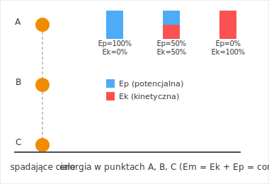

# 3.4. Zasada zachowania energii mechanicznej

📚 *Zobacz na Khan Academy: [Co nazywamy zasadą zachowania energii?](https://pl.khanacademy.org/science/physics/work-and-energy/work-and-energy-tutorial/a/what-is-conservation-of-energy)*

📚 *Zobacz na Khan Academy: [Zasada zachowania energii (film)](https://pl.khanacademy.org/science/physics/work-and-energy/work-and-energy-tutorial/v/conservation-of-energy)*

### Treść zasady

**Energia mechaniczna** ciała to suma jego energii kinetycznej i energii potencjalnej (grawitacji i/lub sprężystości):

**Ec = Ek + Ep**

Jeżeli na ciało nie działają siły tarcia ani opory ruchu (mówimy wtedy o **układzie zamkniętym** albo **braku strat energii**), to zachodzi **zasada zachowania energii mechanicznej**:

> Całkowita energia mechaniczna ciała pozostaje stała — energia kinetyczna może zamieniać się w potencjalną i odwrotnie, ale ich suma się nie zmienia.

**Ek + Ep = const**, czyli np. dla ciała spadającego swobodnie: **Ek₁ + Ep₁ = Ek₂ + Ep₂**

To jedno z najczęściej sprawdzanych praw na konkursie zDolny Ślązak — zwłaszcza w wersji "co się dzieje z energią piłki w locie" albo "co się dzieje z energią sanek zjeżdżających z górki".

### Ciekawostka: dlaczego "perpetuum mobile" nigdy nie zadziała

Od średniowiecza po dziś dzień setki wynalazców próbowały skonstruować **perpetuum mobile** — urządzenie, które raz uruchomione, działałoby (a najlepiej nawet wytwarzało użyteczną pracę) samo, bez żadnego dopływu energii z zewnątrz. Rysowano fantazyjne koła z przesuwającymi się ciężarkami, "wieczne" młyny wodne pompujące wodę na własny młyn i dziesiątki innych pomysłowych konstrukcji.

Żadna z nich nie zadziałała — i nie zadziała, bo łamałoby to zasadę zachowania energii. Skąd urządzenie miałoby brać energię na wykonywanie pracy w kolejnym cyklu, jeśli nie z zewnątrz i nie z zapasu, który się kończy? W praktyce każde realne urządzenie ma jakieś straty (tarcie, opór powietrza), więc bez dopływu energii z zewnątrz jego energia mechaniczna z każdym cyklem tylko **maleje**, aż ruch zupełnie zamiera. Dlatego fizycy traktują zasadę zachowania energii jak niezawodny "wykrywacz oszustw": jeśli ktoś reklamuje urządzenie produkujące energię z niczego, można być z góry pewnym, że coś jest nie tak z jego konstrukcją (albo z pomiarami).

*Rysunek 4. Ciało spadające swobodnie z punktu A do C. Suma słupków Ep + Ek (czyli energia mechaniczna) jest w każdym punkcie taka sama — zmienia się tylko proporcja między nimi.*

Gdy pojawia się tarcie lub opór powietrza, energia mechaniczna **nie jest** zachowana — część zamienia się w energię wewnętrzną (ciepło), o czym dowiesz się więcej w dziale o termodynamice. Wtedy energia mechaniczna na końcu ruchu jest mniejsza niż na początku.

### Ciekawostka: hamowanie, które nie "wyrzuca" energii

W zwykłym samochodzie z hamulcami ciernymi cała energia kinetyczna podczas hamowania zamienia się w ciepło rozgrzewające klocki i tarcze hamulcowe — to ciepło "ulatuje" do otoczenia i jest bezużyteczne (choć zgodnie z zasadą zachowania energii sama energia nigdzie nie zniknęła, tylko zmieniła postać z mechanicznej na wewnętrzną/cieplną).

Samochody elektryczne i hybrydowe potrafią jednak część tej energii **odzyskać** dzięki **hamowaniu regeneracyjnemu**: podczas hamowania silnik elektryczny pracuje "na odwrót", jak generator, zamieniając energię kinetyczną pojazdu na energię elektryczną, która ładuje akumulator, zamiast na bezużyteczne ciepło klocków hamulcowych. To wciąż nie jest żadnym "łamaniem" zasady zachowania energii mechanicznej — energia mechaniczna pojazdu i tak maleje podczas hamowania, tak jak w każdym przypadku z tarciem. Różnica jest tylko w tym, dokąd trafia ta "tracona" energia: do bezużytecznego ciepła, czy do naładowanego akumulatora, z którego można ją później znów wykorzystać.

### Przykład

**Treść zadania:** Kamień o masie 0,2 kg spada swobodnie (bez oporów powietrza) z wysokości 5 m nad ziemią. Korzystając z zasady zachowania energii mechanicznej, oblicz prędkość kamienia tuż przed uderzeniem o ziemię (g = 10 m/s²).

**Rozwiązanie krok po kroku:**

1. Dane: m = 0,2 kg, h = 5 m, g = 10 m/s², v_początkowe = 0 (kamień spada "z ręki", bez prędkości początkowej).
2. Na początku (na wysokości h) cała energia mechaniczna to energia potencjalna: Ec = Ep = m · g · h.
3. Tuż przed ziemią (h = 0) cała energia mechaniczna to energia kinetyczna: Ec = Ek = ½ · m · v².
4. Z zasady zachowania energii: m · g · h = ½ · m · v². Masa m upraszcza się po obu stronach!
5. g · h = ½ · v², czyli v² = 2 · g · h = 2 · 10 m/s² · 5 m = 100 m²/s².
6. v = √100 m²/s² = 10 m/s.

**Odpowiedź:** Kamień uderzy o ziemię z prędkością 10 m/s — i zauważ, że wynik w ogóle nie zależy od masy kamienia!

[⬅ Powrót do spisu treści](3.0_praca_moc_energia.md)
