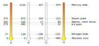
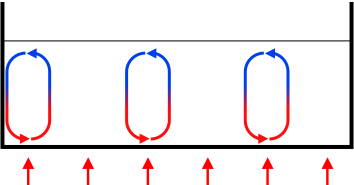
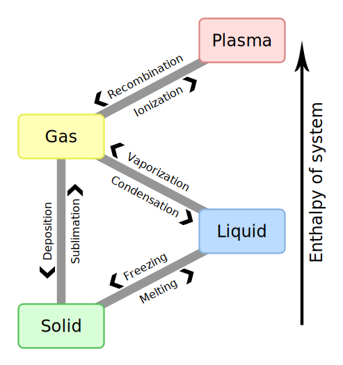
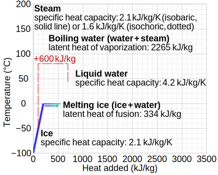
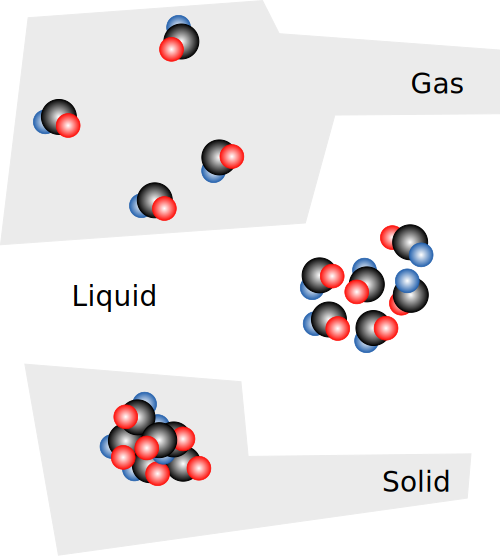

# 4. Termodynamika

Termodynamika to dział fizyki, który zajmuje się ciepłem, temperaturą i tym, jak energia przepływa między ciałami. W tym rozdziale dowiesz się, czym naprawdę jest temperatura, dlaczego zimą kaloryfer grzeje pokój, dlaczego pocenie się chłodzi ciało oraz jak obliczać ilość ciepła potrzebną do ogrzania wody na herbatę.

---

## 4.1. Temperatura i równowaga termodynamiczna

**Temperatura** to wielkość fizyczna, która mówi nam, jak "gorące" albo "zimne" jest dane ciało. Z punktu widzenia budowy materii temperatura jest miarą tego, jak szybko poruszają się cząsteczki (atomy, cząsteczki) tworzące dane ciało — im szybszy jest ich chaotyczny ruch, tym wyższa temperatura.

Temperaturę mierzymy **termometrem**. Najprostszy termometr cieczowy wykorzystuje zjawisko rozszerzalności cieplnej: ciecz (dawniej rtęć, dziś często alkohol barwiony na czerwono) rozszerza się, gdy rośnie jej temperatura, i kurczy, gdy temperatura spada.

**Równowaga termodynamiczna (cieplna)** to stan, w którym dwa ciała zetknięte ze sobą (lub oddzielone ścianką przewodzącą ciepło) mają **taką samą temperaturę** i przestaje między nimi płynąć ciepło netto. Jeśli dotkniesz szklanki z gorącą herbatą, ciepło płynie od herbaty do Twojej ręki (i do powietrza), aż w końcu wszystko — herbata, szklanka, powietrze w pokoju — osiągnie tę samą temperaturę. To właśnie **zerowa zasada termodynamiki**: jeśli ciało A ma taką samą temperaturę jak ciało B, a ciało B ma taką samą temperaturę jak ciało C, to A i C też mają tę samą temperaturę. Dzięki tej zasadzie termometr w ogóle ma sens — termometr "dochodzi" do równowagi z badanym ciałem i pokazuje jego temperaturę.

**Ważne:** ciepło zawsze płynie samoistnie od ciała cieplejszego do ciała zimniejszego, nigdy odwrotnie (bez dodatkowej pracy, np. lodówki).

### Przykład

Do termosu wlano gorącą herbatę o temperaturze 80°C i zamknięto. Po 3 godzinach zmierzono temperaturę herbaty — wynosiła 78°C, a temperatura powietrza w pokoju to 20°C przez cały czas.

**Rozwiązanie:**
Termos jest dobrym izolatorem, więc bardzo wolno oddaje ciepło do otoczenia. Mimo to po 3 godzinach herbata i powietrze w pokoju wciąż mają różne temperatury (78°C ≠ 20°C) — układ **nie osiągnął** jeszcze równowagi termodynamicznej. Gdybyśmy poczekali bardzo długo, temperatura herbaty spadłaby do temperatury pokojowej (20°C) i wtedy układ osiągnąłby równowagę.

**Odpowiedź:** Układ herbata–powietrze nie jest w równowadze termodynamicznej, bo temperatury są różne; ciepło nadal (bardzo powoli) płynie z herbaty do otoczenia.

---

## 4.2. Skale temperatur (Celsjusza, Kelvina, Fahrenheita) i ich przeliczanie

Istnieją różne skale, w których wyrażamy temperaturę:

- **Skala Celsjusza (°C)** — najczęściej używana w Polsce i Europie. Punkt 0°C to temperatura zamarzania wody, a 100°C to temperatura wrzenia wody (przy normalnym ciśnieniu atmosferycznym).
- **Skala Kelvina (K)** — skala **bezwzględna**, używana w nauce (jest jednostką układu SI). Zaczyna się od **zera bezwzględnego** (0 K = −273,15°C) — to najniższa możliwa temperatura we Wszechświecie, przy której ustaje chaotyczny ruch cząsteczek. Ważne: w skali Kelvina nie mówimy "stopni Kelvina", tylko po prostu **kelwiny**, i nie piszemy znaku °.
- **Skala Fahrenheita (°F)** — używana głównie w USA. Woda zamarza przy 32°F, a wrze przy 212°F.

### Wzory przeliczeniowe

$$T[K] = t[°C] + 273,15$$

$$t[°C] = T[K] - 273,15$$

$$t[°F] = t[°C] \cdot \frac{9}{5} + 32$$

$$t[°C] = (t[°F] - 32) \cdot \frac{5}{9}$$

**Uwaga:** Wielkości oznaczane wielką literą T zwykle dotyczą skali Kelvina (temperatura bezwzględna), a małą literą t — skali Celsjusza lub Fahrenheita.

### Ilustracja 1: porównanie skal temperatur na wspólnej osi

*Źródło: Baltakatei, [Temperature scales comparison (K,R,C,F).svg](https://commons.wikimedia.org/wiki/File:Temperature_scales_comparison_(K,R,C,F).svg), Wikimedia Commons, licencja CC BY-SA 4.0.*

Diagram pokazuje, obok omawianych w tym rozdziale skal Kelvina, Celsjusza i Fahrenheita, dodatkowo rzadziej spotykaną skalę Rankine'a (R) — bezwzględną skalę temperatury opartą na stopniach Fahrenheita (podobnie jak Kelvin jest skalą bezwzględną opartą na stopniach Celsjusza). Na osiach zaznaczono punkty charakterystyczne: zero bezwzględne, punkt zamarzania wody (punkt lodu), przybliżoną temperaturę pokojową, punkt wrzenia wody (punkt pary), a także temperatury wrzenia azotu i rtęci — dla porównania, jak szeroki jest zakres temperatur spotykanych w przyrodzie i technice.

### Przykład

Za oknem termometr w skali Fahrenheita (typowy dla USA) pokazuje 68°F. Jaka to temperatura w stopniach Celsjusza i w kelwinach?

**Rozwiązanie:**

Krok 1 — przeliczamy z Fahrenheita na Celsjusza:
$$t[°C] = (68 - 32) \cdot \frac{5}{9} = 36 \cdot \frac{5}{9} = 20°C$$

Krok 2 — przeliczamy stopnie Celsjusza na kelwiny:
$$T[K] = 20 + 273,15 = 293,15 \ K$$

**Odpowiedź:** 68°F to 20°C, czyli 293,15 K — to zwykła, przyjemna temperatura pokojowa.

---

## 4.3. Energia wewnętrzna i ciepło

**Energia wewnętrzna** ciała to suma:
- energii kinetycznej chaotycznego ruchu wszystkich cząsteczek ciała (im szybszy ruch, tym większa),
- energii potencjalnej wzajemnego oddziaływania (przyciągania/odpychania) tych cząsteczek.

Energię wewnętrzną ciała możemy zmienić na dwa sposoby:
1. **Wykonując pracę** — np. pompując rowerowa pompką, ścierając dłonie o siebie (tarcie), zgniatając coś.
2. **Przekazując ciepło** — czyli energię, która "sama" przepływa między ciałami o różnych temperaturach, bez wykonywania pracy mechanicznej.

**Ciepło (Q)** to zatem energia przekazywana między ciałami na skutek różnicy temperatur. Ciepło **nie jest** czymś, co ciało "posiada" — ciało posiada energię wewnętrzną, a ciepło to tylko forma energii "w drodze", przekazywana od cieplejszego do zimniejszego ciała. Jednostką ciepła — tak jak każdej energii — jest **dżul (J)**.

**Bardzo ważna zasada (I zasada termodynamiki, w uproszczeniu):** zmiana energii wewnętrznej ciała jest równa sumie ciepła dostarczonego do ciała i pracy wykonanej nad ciałem:

$$\Delta U = Q + W$$

gdzie ΔU — zmiana energii wewnętrznej, Q — dostarczone ciepło, W — praca wykonana nad ciałem.

To oznacza, że można dostarczyć ciału ciepło, a jego energia wewnętrzna wcale nie musi wzrosnąć — jeśli ciało w tym samym czasie samo wykona pracę o takiej samej wartości (czyli W we wzorze jest ujemne, bo to praca wykonana *przez* ciało, nie *nad* nim). Przykład: gaz w silniku pochłania ciepło i jednocześnie rozpręża się, wykonując pracę nad tłokiem — traci na to tyle energii, na ile ją zyskał z ciepła, więc jego energia wewnętrzna może się nie zmienić.

### Przykład

Uczeń pociera dłonie o siebie przez chwilę i czuje, że robią się ciepłe, mimo że nikt nie dostarczył mu ciepła z zewnątrz (w pokoju jest chłodno).

**Rozwiązanie:**
Tarcie dłoni o siebie to wykonywanie pracy mechanicznej (W > 0), a nie przekazywanie ciepła (Q = 0, bo nie ma różnicy temperatur, która by je wywołała — na początku obie dłonie mają tę samą temperaturę). Zgodnie ze wzorem ΔU = Q + W, skoro W > 0, to energia wewnętrzna dłoni rośnie (ΔU > 0), mimo że Q = 0. Dlatego dłonie robią się cieplejsze — ich energia wewnętrzna wzrosła kosztem pracy mięśni, a nie ciepła z otoczenia.

**Odpowiedź:** Dłonie ogrzały się dzięki wykonanej pracy tarcia, a nie dzięki ciepłu — to dobry przykład na to, że energię wewnętrzną można zwiększyć bez przekazywania ciepła.

---

## 4.4. Związek temperatury ze średnią energią kinetyczną cząsteczek

Wszystkie cząsteczki materii (nawet w ciele stałym) znajdują się w ciągłym, chaotycznym ruchu — nazywamy go **ruchem cieplnym**. W gazach cząsteczki swobodnie fruwają i zderzają się ze sobą, w cieczach przesuwają się względem siebie, a w ciałach stałych drgają wokół ustalonych położeń.

**Kluczowy związek:** temperatura ciała jest miarą **średniej energii kinetycznej** ruchu cieplnego jego cząsteczek. Im wyższa temperatura, tym szybciej (średnio) poruszają się cząsteczki i tym większa jest ich średnia energia kinetyczna. To nie oznacza, że wszystkie cząsteczki poruszają się z tą samą prędkością — jedne są szybsze, inne wolniejsze, ale **średnia** energia kinetyczna rośnie wraz z temperaturą.

Przy **zerze bezwzględnym** (0 K = −273,15°C) chaotyczny ruch cząsteczek teoretycznie ustaje niemal całkowicie (pozostaje tylko minimalna, tzw. energia drgań zerowych wynikająca z mechaniki kwantowej) — to dlatego 0 K jest granicą, poniżej której nie da się zejść.

To wyjaśnia też, dlaczego podgrzewanie gazu w zamkniętym naczyniu zwiększa ciśnienie: cząsteczki poruszają się szybciej, częściej i mocniej uderzają w ścianki naczynia.

### Przykład

W balonie napełnionym powietrzem podgrzano gaz z 20°C do 40°C, nie zmieniając objętości balonu. Czy średnia energia kinetyczna cząsteczek powietrza się podwoiła?

**Rozwiązanie:**
To częsty błąd! Nie można porównywać energii kinetycznej wprost przez stopnie Celsjusza — trzeba przeliczyć na kelwiny (skalę bezwzględną), bo to ona jest proporcjonalna do średniej energii kinetycznej cząsteczek.

Krok 1 — przeliczamy temperatury na kelwiny:
$$T_1 = 20 + 273 = 293 \ K$$
$$T_2 = 40 + 273 = 313 \ K$$

Krok 2 — porównujemy:
$$\frac{T_2}{T_1} = \frac{313}{293} \approx 1,07$$

Średnia energia kinetyczna wzrosła tylko około 1,07 razy (czyli o ok. 7%), a nie dwukrotnie.

**Odpowiedź:** Nie, energia kinetyczna cząsteczek nie podwoiła się — wzrosła tylko nieznacznie (o ok. 7%), ponieważ do takich porównań musimy używać skali Kelvina, a nie Celsjusza.

---

## 4.5. Przewodnictwo cieplne i konwekcja

Ciepło może przemieszczać się z miejsca o wyższej temperaturze do miejsca o niższej temperaturze na kilka sposobów:

**Przewodnictwo cieplne (przewodzenie)** — zachodzi głównie w ciałach stałych, przy **bezpośrednim kontakcie**. Cząsteczki o większej energii kinetycznej przekazują część tej energii sąsiednim cząsteczkom (poprzez zderzenia/drgania), a te kolejnym — samo ciepło "przechodzi" przez materiał, ale cząsteczki materiału nie przemieszczają się na duże odległości. Metale (np. żelazo, miedź, aluminium) są bardzo dobrymi przewodnikami ciepła. Powietrze, wełna, styropian, drewno to **izolatory cieplne** — przewodzą ciepło bardzo słabo (dlatego zimą ubieramy się w wełniane swetry — uwięzione w nich powietrze nie przewodzi ciepła naszego ciała na zewnątrz).

**Konwekcja** — zachodzi w **cieczach i gazach** (płynach) i polega na tym, że ogrzane porcje płynu, stając się mniej gęste (lżejsze), unoszą się do góry, a chłodniejsze, gęstsze porcje opadają w dół, zajmując ich miejsce. Powstaje w ten sposób krążący **prąd konwekcyjny**, który przenosi ciepło razem z przemieszczającą się materią. Dzięki konwekcji grzejnik ustawiony przy podłodze ogrzewa cały pokój, a nie tylko powietrze tuż przy sobie.

**Promieniowanie cieplne** — trzeci sposób przekazywania ciepła (wspominany też w zadaniach konkursowych) — energia jest przekazywana falami elektromagnetycznymi (np. podczerwonymi) i, w przeciwieństwie do przewodzenia i konwekcji, **nie wymaga żadnego ośrodka** — może zachodzić nawet w próżni (tak Słońce ogrzewa Ziemię).

### Ilustracja 2: konwekcja w płynie podgrzewanym od dołu (np. w garnku z wodą)

*Źródło: Theresa Knott, Joanjoc, McSush, [Convection cells.svg](https://commons.wikimedia.org/wiki/File:Convection_cells.svg), Wikimedia Commons, licencja CC BY-SA 3.0 / GFDL.*

Strzałki pokazują prądy konwekcyjne (tzw. komórki konwekcyjne): płyn przy dnie ogrzewa się (dopływ ciepła zaznaczony czerwonymi strzałkami na dole), staje się lżejszy i unosi do góry, a ochłodzony przy powierzchni, cięższy płyn opada z powrotem w dół — powstaje krążący ruch, który stopniowo ogrzewa całą objętość naczynia. Dokładnie taki mechanizm zachodzi w garnku z wodą podgrzewanym od dołu.

### Przykład

Dlaczego rączki metalowego garnka są zwykle pokryte plastikiem lub drewnem, a sam garnek jest metalowy?

**Rozwiązanie:**
Garnek musi być zrobiony z materiału, który **dobrze przewodzi ciepło** (metal), żeby ciepło z palnika szybko dotarło do potrawy wewnątrz. Natomiast rączka powinna być zrobiona z materiału, który **słabo przewodzi ciepło** (izolatora — plastiku, drewna), żeby dłoń trzymająca rączkę się nie poparzyła. To świadome wykorzystanie różnicy w przewodnictwie cieplnym różnych materiałów.

**Odpowiedź:** Garnek jest metalowy, bo metal dobrze przewodzi ciepło (szybkie gotowanie), a rączka jest z izolatora (plastik/drewno), by nie przewodziła ciepła do dłoni i nie poparzyła osoby gotującej.

---

## 4.6. Przemiany fazowe: topnienie, krzepnięcie, parowanie, skraplanie, sublimacja, resublimacja

Materia występuje w trzech podstawowych **stanach skupienia**: stałym, ciekłym i gazowym. Przejście między nimi nazywamy **przemianą fazową** (zmianą stanu skupienia). Każda przemiana fazowa ma swoją nazwę:

| Przemiana | Kierunek | Energia |
|---|---|---|
| **Topnienie** | ciało stałe → ciecz | pochłanianie energii |
| **Krzepnięcie** | ciecz → ciało stałe | oddawanie energii |
| **Parowanie** (wrzenie/parowanie powierzchniowe) | ciecz → gaz | pochłanianie energii |
| **Skraplanie** | gaz → ciecz | oddawanie energii |
| **Sublimacja** | ciało stałe → gaz (z pominięciem cieczy) | pochłanianie energii |
| **Resublimacja** (zwana też depozycją) | gaz → ciało stałe (z pominięciem cieczy) | oddawanie energii |

**Zasada zapamiętania:** przemiany "w stronę" bardziej rozproszonego stanu (stały→ciekły→gazowy) zawsze **pochłaniają** energię, a przemiany odwrotne zawsze ją **oddają**.

Bardzo ważna obserwacja doświadczalna: **podczas przemiany fazowej temperatura ciała się nie zmienia**, mimo że cały czas dostarczamy (lub odbieramy) ciepło! Cała dostarczana energia jest zużywana na "rozerwanie" (albo, przy krzepnięciu — "budowę") wiązań między cząsteczkami, a nie na przyspieszenie ich ruchu. Dopiero gdy cała substancja zmieni stan skupienia, dalsze dostarczanie ciepła znowu podnosi temperaturę.

### Ilustracja 3: diagram przemian fazowych

*Źródło: F l a n k e r, penubag, [Phase change - en.svg](https://commons.wikimedia.org/wiki/File:Phase_change_-_en.svg), Wikimedia Commons, domena publiczna (public domain).*

Diagram dodatkowo pokazuje czwarty stan skupienia materii — **plazmę** (np. materia we wnętrzu gwiazd albo błyskawica) — oraz przejścia do niej i z niej: **jonizację** (gaz → plazma) i **rekombinację** (plazma → gaz). Plazma nie jest częścią materiału tego rozdziału, ale warto wiedzieć, że to czwarty, "najbardziej rozproszony" stan skupienia. Angielskie nazwy na diagramie odpowiadają polskim: *melting* = topnienie, *freezing* = krzepnięcie, *vaporization* = parowanie, *condensation* = skraplanie, *sublimation* = sublimacja, *deposition* = resublimacja.

### Ilustracja 4: wykres temperatury lodu ogrzewanego do pary wodnej

Poniższy wykres pokazuje, jak zmienia się temperatura wody, gdy stale dostarczamy jej ciepło — od lodu poniżej 0°C, przez topnienie, ogrzewanie cieczy, wrzenie, aż po ogrzewanie pary wodnej (oś pozioma — ciepło dostarczone w przeliczeniu na 1 kg substancji, oś pionowa — temperatura):

*Źródło: Cmglee, [Water temperature vs heat added.svg](https://commons.wikimedia.org/wiki/File:Water_temperature_vs_heat_added.svg), Wikimedia Commons, licencja CC BY-SA 4.0 / GFDL.*

Widać wyraźnie dwa **plateau** (odcinki poziome) — przy 0°C (topnienie lodu) i przy 100°C (wrzenie wody). W tych miejscach temperatura się nie zmienia, mimo że ciepło cały czas jest dostarczane — energia "idzie" na zmianę stanu skupienia, a nie na wzrost temperatury.

### Przykład

Rozpoznaj przemianę fazową: rano na trawie pojawiają się krople rosy, a para z oddechu w mroźny dzień od razu zamienia się w drobniutkie kryształki szronu unoszące się w powietrzu.

**Rozwiązanie:**
- Krople rosy powstają, gdy para wodna zawarta w powietrzu (gaz) zamienia się w ciekłą wodę na chłodnej trawie — to **skraplanie** (gaz → ciecz).
- Para z oddechu w mroźny dzień, zamieniająca się bezpośrednio w drobne kryształki lodu (z pominięciem stanu ciekłego), to **resublimacja** (gaz → ciało stałe).

**Odpowiedź:** Rosa na trawie to skraplanie, a zamarzająca para oddechu w mróz to resublimacja.

---

## 4.7. Ciepło właściwe i ciepło przemiany fazowej

**Ciepło właściwe (c)** to wielkość fizyczna mówiąca, ile energii (ciepła) potrzeba, aby ogrzać **1 kilogram** danej substancji o **1 stopień** (1°C lub, równoważnie, 1 K). Różne substancje mają różne ciepło właściwe — np. woda ma bardzo duże ciepło właściwe (4200 J/(kg·°C)), co oznacza, że trudno ją ogrzać (i trudno ochłodzić) — dlatego morza i oceany łagodzą klimat w swoim sąsiedztwie.

### Wzór na ilość ciepła potrzebną do zmiany temperatury

$$Q = c \cdot m \cdot \Delta T$$

gdzie:
- Q — ilość ciepła (w dżulach, J),
- c — ciepło właściwe substancji (w J/(kg·°C) lub J/(kg·K) — to to samo, bo różnica 1°C = różnica 1 K),
- m — masa ciała (w kg),
- ΔT — zmiana temperatury, czyli T_końcowa − T_początkowa (w °C lub K).

### Ciepło przemiany fazowej

Aby stopić, zamrozić, wyparować lub skroplić substancję, potrzebujemy energii, ale ta energia **nie** zmienia temperatury (patrz plateau na wykresie w 4.6) — zamiast tego zmienia stan skupienia. Ilość tej energii opisuje **ciepło przemiany fazowej** (np. ciepło topnienia, ciepło parowania):

$$Q = L \cdot m$$

gdzie L — ciepło właściwe przemiany fazowej (np. ciepło topnienia lodu wynosi ok. 334 000 J/kg, czyli 334 kJ/kg; ciepło parowania wody to ok. 2 260 000 J/kg = 2260 kJ/kg), a m — masa substancji zmieniającej stan skupienia.

### Przykład

Ile ciepła trzeba dostarczyć, aby ogrzać 2 kg wody od temperatury 20°C do 80°C? Ciepło właściwe wody wynosi c = 4200 J/(kg·°C).

**Rozwiązanie:**

Dane: m = 2 kg, T₁ = 20°C, T₂ = 80°C, c = 4200 J/(kg·°C)

Krok 1 — obliczamy zmianę temperatury:
$$\Delta T = T_2 - T_1 = 80°C - 20°C = 60°C$$

Krok 2 — stosujemy wzór na ciepło:
$$Q = c \cdot m \cdot \Delta T = 4200 \ \frac{J}{kg \cdot °C} \cdot 2 \ kg \cdot 60°C$$

$$Q = 4200 \cdot 2 \cdot 60 = 504\,000 \ J = 504 \ kJ$$

**Odpowiedź:** Trzeba dostarczyć 504 000 J (czyli 504 kJ) ciepła.

### Przykład 2 (przemiana fazowa)

Ile energii potrzeba, aby stopić 0,5 kg lodu o temperaturze 0°C (bez zmiany temperatury, tylko zamiana lodu w wodę)? Ciepło topnienia lodu wynosi L = 334 000 J/kg.

**Rozwiązanie:**

Dane: m = 0,5 kg, L = 334 000 J/kg

$$Q = L \cdot m = 334\,000 \ \frac{J}{kg} \cdot 0,5 \ kg = 167\,000 \ J = 167 \ kJ$$

**Odpowiedź:** Do stopienia 0,5 kg lodu potrzeba 167 000 J (167 kJ) energii — i cała ta energia zostanie zużyta na zmianę stanu skupienia, a nie na podniesienie temperatury (temperatura pozostanie 0°C, aż cały lód się stopi).

---

## 4.8. Budowa cząsteczkowa ciał stałych, cieczy i gazów

Wszystkie substancje zbudowane są z cząsteczek (lub atomów), które są w ciągłym ruchu i oddziałują na siebie siłami przyciągania. To, jak silne jest to przyciąganie w porównaniu z energią ruchu cząsteczek, decyduje o stanie skupienia:

**Ciało stałe:**
- Cząsteczki są ułożone blisko siebie, w uporządkowany sposób (np. w sieci krystalicznej), i silnie ze sobą oddziałują.
- Cząsteczki **nie** przemieszczają się swobodnie — mogą jedynie **drgać** wokół swoich stałych położeń.
- Efekt: ciało stałe ma **stały kształt i stałą objętość**, jest trudne do ściśnięcia i trudne do zmiany kształtu.

**Ciecz:**
- Cząsteczki są blisko siebie (podobnie jak w ciele stałym), ale oddziaływania są słabsze — cząsteczki mogą się przesuwać względem siebie, "przepływać".
- Efekt: ciecz ma **stałą objętość, ale zmienny kształt** — przyjmuje kształt naczynia, w którym się znajduje.

**Gaz:**
- Cząsteczki są bardzo daleko od siebie (w porównaniu do swoich rozmiarów), poruszają się swobodnie, szybko i chaotycznie, a oddziaływania między nimi są bardzo słabe (prawie ich nie ma, poza chwilowymi zderzeniami).
- Efekt: gaz **nie ma ani stałego kształtu, ani stałej objętości** — rozprzestrzenia się i wypełnia całą dostępną przestrzeń, łatwo go ścisnąć.

### Ilustracja 5: schemat budowy cząsteczkowej trzech stanów skupienia

*Źródło: Luis Javier Rodriguez Lopez (Yupi666), konwersja do SVG: Tomtheman5, [Solid liquid gas.svg](https://commons.wikimedia.org/wiki/File:Solid_liquid_gas.svg), Wikimedia Commons, licencja CC BY-SA 3.0 / CC BY 2.5 / GFDL.*

Rysunek przedstawia cząsteczki wody (H₂O) w trzech stanach skupienia: w **gazie** cząsteczki są rozproszone daleko od siebie, w **cieczy** są już znacznie bliżej siebie (choć wciąż mogą się swobodnie przesuwać względem siebie), a w **ciele stałym** są ciasno, gęsto upakowane (w rzeczywistości ułożone w uporządkowaną sieć krystaliczną — na tym uproszczonym rysunku widać przede wszystkim samo bliskie upakowanie cząsteczek, opisane szerzej w tekście powyżej).

### Przykład

Dlaczego gazy dają się bardzo łatwo sprężyć (np. w pompce rowerowej można "wcisnąć" powietrze w mniejszą objętość), a cieczy (np. wody) praktycznie nie da się ścisnąć?

**Rozwiązanie:**
W gazie cząsteczki znajdują się bardzo daleko od siebie — między nimi jest dużo wolnej przestrzeni. Gdy zmniejszamy objętość (np. wciskając tłok pompki), po prostu "upychamy" cząsteczki bliżej siebie, wykorzystując tę wolną przestrzeń — to możliwe, bo oddziaływania między cząsteczkami gazu są bardzo słabe.

W cieczy cząsteczki są już blisko siebie, niemal się stykają — nie ma prawie żadnej wolnej przestrzeni do wykorzystania. Próba dalszego ściśnięcia oznaczałaby "wciśnięcie" cząsteczek jedna w drugą, czemu silnie przeciwstawiają się siły odpychania między nimi na bliskich odległościach.

**Odpowiedź:** Gazy mają dużo wolnej przestrzeni między cząsteczkami, więc łatwo je ścisnąć; w cieczach cząsteczki już są blisko siebie, więc praktycznie nie da się zmniejszyć ich objętości.

---

## Quiz

Poniższy quiz sprawdza znajomość całego rozdziału 4 (Termodynamika). Zadania są w stylu podobnym do etapu szkolnego konkursu zDolny Ślązak — jednokrotny wybór, ocena prawda/fałsz oraz zadania rachunkowe.

**1.** Które zdanie o zerze bezwzględnym jest prawdziwe?
- [ ] A. Zero bezwzględne to 0°C.
- [ ] B. Zero bezwzględne to temperatura, w której woda zamarza.
- [ ] C. Zero bezwzględne to najniższa możliwa temperatura, wynosząca −273,15°C.
- [ ] D. Zero bezwzględne to temperatura, w której woda wrze.

**2.** Termometr pokazuje temperaturę 5°F. Ile to jest w przybliżeniu w stopniach Celsjusza?
- [ ] A. około −15°C
- [ ] B. około 5°C
- [ ] C. około 41°C
- [ ] D. około −20°C

**3.** Oceń prawdziwość poniższych zdań (P/F):
   a) Energia wewnętrzna ciała to to samo, co ciepło, które ciało posiada.
   b) Ciepło może być przekazywane między ciałami, które mają tę samą temperaturę.
   c) Energię wewnętrzną ciała można zwiększyć, wykonując nad nim pracę, bez dostarczania mu ciepła.

**4.** Gaz w zamkniętym, sztywnym pojemniku ogrzano od temperatury 27°C do temperatury 327°C. Ile razy wzrosła (w przybliżeniu) średnia energia kinetyczna cząsteczek gazu?
- [ ] A. 2 razy
- [ ] B. 12 razy
- [ ] C. 300 razy
- [ ] D. wzrosła nieznacznie, mniej niż 1,1 raza

**5.** Które z poniższych zjawisk jest przykładem konwekcji, a nie przewodnictwa cieplnego?
- [ ] A. Ogrzewanie się rączki metalowej łyżki włożonej do gorącej zupy.
- [ ] B. Krążenie ciepłego powietrza unoszącego się nad kaloryferem i opadania chłodniejszego powietrza znad okna.
- [ ] C. Ogrzewanie się dna garnka stojącego na kuchence.
- [ ] D. Przekazywanie ciepła przez ściankę termosu.

**6.** Oceń prawdziwość poniższych zdań o przemianach fazowych (P/F):
   a) Sublimacja to przejście ze stanu gazowego bezpośrednio w stan stały.
   b) Podczas topnienia lodu w temperaturze 0°C temperatura mieszaniny lód-woda pozostaje stała, dopóki cały lód się nie stopi.
   c) Skraplanie jest procesem, w którym substancja oddaje energię do otoczenia.

**7.** Do 3 kg wody o temperaturze 15°C dostarczono 126 000 J ciepła. Ciepło właściwe wody wynosi 4200 J/(kg·°C). Jaka będzie końcowa temperatura wody (zakładamy brak strat ciepła)?
- [ ] A. 20°C
- [ ] B. 25°C
- [ ] C. 30°C
- [ ] D. 35°C

**8.** Ile energii potrzeba, aby całkowicie odparować 0,2 kg wody o temperaturze wrzenia (100°C)? Ciepło parowania wody wynosi 2 260 000 J/kg.
- [ ] A. 45 200 J
- [ ] B. 226 000 J
- [ ] C. 452 000 J
- [ ] D. 2 260 000 J

**9.** Które zdanie o budowie cząsteczkowej gazów, cieczy i ciał stałych jest FAŁSZYWE?
- [ ] A. W ciele stałym cząsteczki mogą jedynie drgać wokół ustalonych położeń.
- [ ] B. W cieczy cząsteczki mogą przesuwać się względem siebie, dlatego ciecz przyjmuje kształt naczynia.
- [ ] C. W gazie odległości między cząsteczkami są bardzo małe, dlatego gazy trudno ścisnąć.
- [ ] D. Gaz nie ma ani stałego kształtu, ani stałej objętości.

**10.** W naczyniu znajduje się 1 kg substancji o nieznanym cieple właściwym. Dostarczenie jej 8400 J ciepła spowodowało wzrost temperatury o 2°C. Jaką substancją może być ta ciecz, jeśli wiadomo, że ciepło właściwe wody wynosi 4200 J/(kg·°C), oleju 2100 J/(kg·°C), a rtęci 140 J/(kg·°C)?
- [ ] A. Woda.
- [ ] B. Olej.
- [ ] C. Rtęć.
- [ ] D. Nie da się tego ustalić na podstawie podanych danych.
