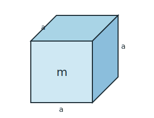

# 5.1. Gęstość — związek masy, gęstości i objętości

📚 *Zobacz na Khan Academy: [Gęstość względna (film)](https://pl.khanacademy.org/science/physics/fluids/density-and-pressure/v/specific-gravity)*

Weźmy dwa jednakowej wielkości sześciany — jeden z drewna, drugi ze stali. Mają taką samą **objętość**, ale stalowy jest dużo cięższy. Dlaczego? Bo materiały różnią się **gęstością** — czyli tym, ile masy „mieści się" w jednej jednostce objętości.

**Gęstość** to stosunek masy ciała do jego objętości:

```
ρ = m / V
```

gdzie:

- `ρ` (czyt. „ro") — gęstość (skalar; w niektórych podręcznikach oznaczana też literą `d`)
- `m` — masa ciała (skalar)
- `V` — objętość ciała (skalar)

Z tego wzoru można też wyliczyć masę (`m = ρ · V`) albo objętość (`V = m / ρ`) — zależnie od tego, co jest niewiadomą w zadaniu.

**Jednostką gęstości** w układzie SI jest kilogram na metr sześcienny (kg/m³), ale w praktyce (i w laboratorium) częściej używa się grama na centymetr sześcienny (g/cm³). Zależność między nimi:

```
1 g/cm³ = 1000 kg/m³
```

Przykładowe gęstości (warto je znać w przybliżeniu):

| Substancja | Gęstość [g/cm³] | Gęstość [kg/m³] |
|---|---|---|
| powietrze | 0,0012 | 1,2 |
| lód | 0,92 | 920 |
| olej jadalny | 0,92 | 920 |
| woda (4°C) | 1,00 | 1000 |
| aluminium | 2,70 | 2700 |
| żelazo / stal | 7,80–7,90 | 7800–7900 |
| miedź | 8,90 | 8900 |
| ołów | 11,3 | 11300 |
| złoto | 19,3 | 19300 |



*Rys. 1. Sześcian o krawędzi `a` i masie `m`. Objętość `V = a · a · a = a³`, a gęstość `ρ = m / V`.*

### Ciekawostka: wieża z pięciu cieczy, które „nie chcą się wymieszać"

Jeśli do wysokiego, wąskiego naczynia wlejemy po kolei (bardzo delikatnie, np. wzdłuż ścianki) kilka różnych cieczy — na przykład miód, płyn do mycia naczyń, wodę, olej jadalny i spirytus — ułożą się jedna nad drugą w oddzielnych warstwach, od najgęstszej na dnie do najlżejszej na wierzchu, i nawet po wstrząśnięciu naczyniem (o ile nie zamieszamy energicznie) po chwili ponownie się rozdzielą. To żywy dowód na to, że gęstość decyduje o tym, „co jest na spodzie, a co na wierzchu": miód (ok. 1,4 g/cm³) opada na dno, płyn do mycia naczyń (ok. 1,0–1,1 g/cm³) i woda (1,0 g/cm³) układają się wyżej, olej (0,92 g/cm³, patrz tabela powyżej) jeszcze wyżej, a spirytus/alkohol izopropylowy (ok. 0,79 g/cm³) unosi się na samym wierzchu. To nie „chemia" miesza im się w głowach — po prostu ciecz o większej gęstości zawsze znajdzie się niżej niż ciecz o mniejszej gęstości, jeśli tylko się ze sobą (prawie) nie mieszają.

### Ciekawostka: sześcian, który ważyłby tyle, co przedszkolak

Osm to najgęstszy pierwiastek, jaki znamy — jego gęstość wynosi około 22,6 g/cm³, czyli ponad 20 razy więcej niż gęstość wody. Sześcian z osmu o krawędzi zaledwie 10 cm (mniejszy niż piłka do koszykówki) ważyłby `m = ρ · V = 22,6 g/cm³ × 1000 cm³ ≈ 22 600 g`, czyli ponad 22 kg — tyle, ile waży średnio pięcio-, sześciolatek! Widać, jak ogromne znaczenie ma gęstość: dwa przedmioty o identycznej objętości mogą różnić się masą kilkudziesięciokrotnie, jeśli są zrobione z materiałów o bardzo różnej gęstości.

### Przykład 1 (obliczanie masy)

**Treść zadania:** Złota kostka ma kształt sześcianu o krawędzi `2 cm`. Gęstość złota wynosi `19,3 g/cm³`. Oblicz masę tej kostki.

**Rozwiązanie krok po kroku:**

1. Obliczamy objętość sześcianu: `V = a³ = 2 cm × 2 cm × 2 cm = 8 cm³`.
2. Korzystamy ze wzoru na masę: `m = ρ · V`.
3. Podstawiamy dane: `m = 19,3 g/cm³ × 8 cm³ = 154,4 g`.

**Odpowiedź:** Kostka złota waży `154,4 g` (czyli `0,1544 kg`).

### Przykład 2 (wyznaczanie gęstości i rozpoznanie materiału)

**Treść zadania:** Uczeń zanurzył metalową odlewaną bryłkę w wodzie wlanej do naczynia pomiarowego. Bryłka wyparła `60 cm³` wody, a jej masa (zmierzona wcześniej na wadze) wynosi `450 g`. Korzystając z tabeli gęstości powyżej, ustal, z jakiego metalu może być wykonana bryłka.

**Rozwiązanie krok po kroku:**

1. Objętość wypartej wody jest równa objętości bryłki (bo bryłka całkowicie zanurzyła się w wodzie): `V = 60 cm³`.
2. Obliczamy gęstość ze wzoru `ρ = m / V`.
3. Podstawiamy dane: `ρ = 450 g / 60 cm³ = 7,5 g/cm³`.
4. Porównujemy wynik z tabelą — najbliższa wartość to gęstość żelaza/stali (7,8–7,9 g/cm³).

**Odpowiedź:** Bryłka najprawdopodobniej jest wykonana z żelaza lub stali (wynik jest zbliżony do tabelarycznej gęstości tych metali; niewielka różnica może wynikać z niedokładności pomiaru).

[⬅ Powrót do spisu treści](5.0_wlasciwosci_materii_i_hydrostatyka.md)
