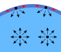
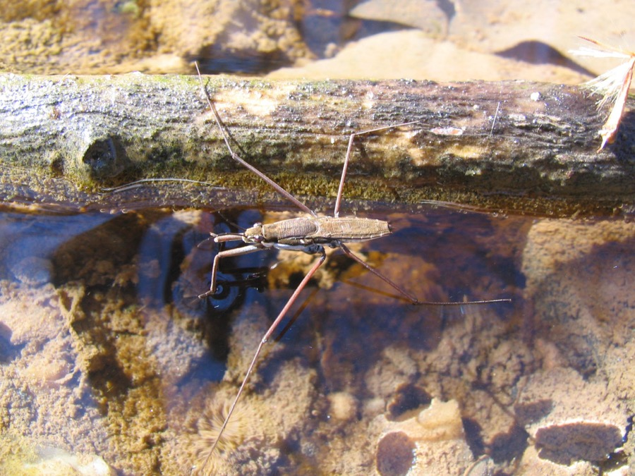

# 5.2. Siły spójności i zjawisko napięcia powierzchniowego

📚 *Zobacz na Khan Academy: [Napięcie powierzchniowe i adhezja (film)](https://pl.khanacademy.org/science/physics/fluids/fluid-dynamics/v/surface-tension-and-adhesion)*

📚 *Zobacz na Khan Academy: [Siły spójności i przylegania wody (artykuł)](https://pl.khanacademy.org/science/biology/water-acids-and-bases/cohesion-and-adhesion/a/cohesion-and-adhesion-in-water)*

Cząsteczki cieczy przyciągają się wzajemnie — to przyciąganie nazywamy **siłami spójności** (kohezji). Wewnątrz cieczy każda cząsteczka jest „ciągnięta" równomiernie ze wszystkich stron przez sąsiadki, więc siły się równoważą. Ale cząsteczka znajdująca się dokładnie **na powierzchni** cieczy ma sąsiadki tylko z boków i od spodu (nad nią jest powietrze, z którym oddziałuje dużo słabiej). W efekcie taka cząsteczka jest „wciągana" do wnętrza cieczy.

Skutkiem tego jest, że powierzchnia cieczy zachowuje się jak cienka, napięta błona, która „chce" mieć jak najmniejsze pole powierzchni. To zjawisko nazywamy **napięciem powierzchniowym**. Dlatego:

- małe krople wody (i inne krople, np. rosy) mają kształt zbliżony do kuli — kula ma najmniejsze pole powierzchni przy danej objętości,
- lekkie przedmioty (igła, spinacz, niektóre owady, np. nartnik) mogą „stać" na powierzchni wody, mimo że są gęstsze od wody — to nie wypór je utrzymuje, tylko napięta „błonka" powierzchniowa,
- dodanie mydła do wody zmniejsza jej napięcie powierzchniowe (dlatego roztwór mydlin łatwiej się rozlewa i tworzy piankę o innej strukturze).

Napięcie powierzchniowe (oznaczane σ, czyt. „sigma") to siła przypadająca na jednostkę długości linii, wzdłuż której powierzchnia cieczy styka się z ciałem lub brzegiem naczynia:

```
σ = F / l
```

gdzie:

- `σ` — napięcie powierzchniowe (skalar)
- `F` — wartość siły (wektor — tu użyta wartość)
- `l` — długość linii styku (skalar)

Jednostką σ w układzie SI jest N/m.

<div align="center">


<p><em>Rys. 2a. Cząsteczka wewnątrz cieczy jest ciągnięta równomiernie ze wszystkich stron (siły się równoważą). Cząsteczka na powierzchni kropli ma sąsiadki tylko z boków i od spodu, więc siła wypadkowa ciągnie ją do wnętrza — dlatego kropla przyjmuje kształt zbliżony do kuli.</em></p>
<p><em>Źródło: Booyabazooka, domena publiczna, <a href="https://commons.wikimedia.org/wiki/File:Wassermolek%C3%BCleInTr%C3%B6pfchen.svg">Wikimedia Commons</a></em></p>


<p><em>Rys. 2b. Nartnik — mimo że jego ciało jest gęstsze od wody — „stoi” na jej powierzchni. Wyraźnie widać zagłębienia („dołki”) w błonie powierzchniowej wokół każdego odnóża; to napięcie powierzchniowe, a nie siła wyporu, utrzymuje owada nad wodą.</em></p>
<p><em>Źródło: Phyzome (Tim McCormack), licencja CC BY-SA 3.0, <a href="https://commons.wikimedia.org/wiki/File:Water_strider_-_surface_tension.jpg">Wikimedia Commons</a></em></p>
</div>

### Ciekawostka: pełna szklanka, do której zmieści się jeszcze łyżka wody

Napełnij szklankę wodą „po samą krawędź", a potem, bardzo delikatnie, dolewaj jeszcze wody łyżeczką (albo wpuszczaj po kolei małe monety). Okaże się, że poziom wody wcale nie musi się przelać, gdy sięgnie równo z krawędzią — woda potrafi się jeszcze wypiętrzyć **nad** krawędzią szklanki, tworząc widoczne, lekko wypukłe „naddatki" (nawet kilka milimetrów wysokości), zanim w końcu przeleje się na stół. To właśnie napięcie powierzchniowe — powierzchnia wody zachowuje się jak naciągnięta, elastyczna błonka, która potrafi „udźwignąć" dodatkową odrobinę cieczy powyżej krawędzi, zamiast natychmiast spływać.

### Zaskakujący przykład: łyżeczka oleju, która uspokoiła kawałek morza

W 1757 roku Benjamin Franklin płynął statkiem do Anglii i zauważył, że fale za niektórymi innymi statkami są dziwnie „wygładzone", mimo że wokół morze było wzburzone. Kapitan wyjaśnił mu, że to zasługa oleju wylanego za burtę. Franklin, jako prawdziwy naukowiec, nie uwierzył „na słowo" i po powrocie do Anglii sam to sprawdził na stawie w Clapham Common: wylał na wzburzoną, pomarszczoną wiatrem powierzchnię stawu **niecałą łyżeczkę oleju** i natychmiast uspokoiła się fala na obszarze wielu metrów kwadratowych! Warstwa oleju była tak cienka (jak później ustalono, miała grubość pojedynczej cząsteczki), że praktycznie niewidoczna — a jednak drastycznie zmniejszyła napięcie powierzchniowe wody i „wygasiła" drobne zafalowania. Dziś wiemy, że to właśnie zmiana napięcia powierzchniowego tłumi małe fale — dokładnie ten sam mechanizm, przez który mydło zmienia zachowanie wody (patrz wyżej).

### Przykład (obliczanie siły napięcia powierzchniowego)

**Treść zadania:** Cienki metalowy pierścionek delikatnie kładziony na powierzchni wody ma obwód (długość linii styku z wodą) równy `8 cm`. Napięcie powierzchniowe wody wynosi około `0,07 N/m`. Oblicz, jaką siłę trzeba przyłożyć, aby oderwać pierścionek od powierzchni wody (pomijamy tu jego ciężar).

**Rozwiązanie krok po kroku:**

1. Zamieniamy jednostki: `l = 8 cm = 0,08 m`.
2. Korzystamy ze wzoru `F = σ · l`.
3. Podstawiamy dane: `F = 0,07 N/m × 0,08 m = 0,0056 N`.

**Odpowiedź:** Trzeba przyłożyć siłę około `0,0056 N` (czyli `5,6 mN`) — to bardzo mała siła, dlatego napięcie powierzchniowe łatwo zauważyć tylko przy lekkich przedmiotach.

[⬅ Powrót do spisu treści](5.0_wlasciwosci_materii_i_hydrostatyka.md)
