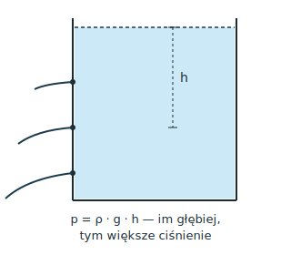

# 5.3. Ciśnienie hydrostatyczne i atmosferyczne, prawo Pascala

📚 *Zobacz na Khan Academy: [Ciśnienie na głębokości w płynie (film)](https://pl.khanacademy.org/science/physics/fluids/density-and-pressure/v/fluids-part-3)*

📚 *Zobacz na Khan Academy: [Ciśnienie i prawo Pascala, część 1 (film)](https://pl.khanacademy.org/science/physics/fluids/density-and-pressure/v/fluids-part-1)*

**Ciśnienie** ogólnie to siła nacisku przypadająca na jednostkę powierzchni:

```
p = F / S
```

gdzie:

- `p` — ciśnienie (skalar)
- `F` — wartość siły (wektor — tu użyta wartość, konkretnie jej składowej prostopadłej do powierzchni)
- `S` — powierzchnia (skalar), na którą ta siła działa

Jednostką ciśnienia w SI jest paskal: `1 Pa = 1 N/m²`.

**Uwaga — częsty błąd:** ciśnienie `p` jest wielkością SKALARNĄ — nie ma kierunku! To siła $\vec{F}$ (w tym wzorze użyta jest jej wartość — konkretnie składowej prostopadłej do powierzchni) ma kierunek. Ciśnienie w danym punkcie cieczy działa jednakowo „we wszystkie strony" właśnie dlatego, że jest liczbą, nie wektorem — zobacz też prawo Pascala niżej. Zobacz temat 0.6.

### Ciśnienie hydrostatyczne

Ciecz ma swój ciężar, więc każda głębsza warstwa cieczy jest „przygnieciona" przez warstwy leżące nad nią. To powoduje **ciśnienie hydrostatyczne** — ciśnienie wywierane przez słup cieczy na dowolne ciało (albo na ścianki naczynia) znajdujące się na danej głębokości:

```
p = ρ · g · h
```

gdzie:

- `p` — ciśnienie hydrostatyczne (skalar),
- `ρ` — gęstość cieczy (skalar),
- `g` — przyspieszenie ziemskie (skalar — tu użyta jego wartość; w zadaniach szkolnych zwykle przyjmujemy `g ≈ 10 N/kg`),
- `h` — głębokość zanurzenia (skalar; odległość od powierzchni cieczy).

**Ważne:** ciśnienie hydrostatyczne na danej głębokości **zależy tylko od gęstości cieczy i głębokości**, a nie od kształtu ani szerokości naczynia! To dlatego w dwóch naczyniach o różnym kształcie, ale takiej samej cieczy i takiej samej wysokości słupa cieczy, ciśnienie na dnie jest identyczne.

### Zaskakujący przykład: „beczka Pascala" — jak łyżka wody może rozsadzić beczkę

To właśnie ta niezależność ciśnienia od ilości cieczy prowadzi do efektu, który brzmi jak żart, a jest prawdziwą fizyką. Wyobraź sobie solidną, w pełni wypełnioną wodą, szczelnie zamkniętą beczkę, do której od góry wstawiono bardzo długą i bardzo wąską rurkę (o przekroju np. mniejszym niż słomka do napojów). Choć w takiej wąskiej rurce mieści się śmiesznie mało wody — czasem niecały litr — to jeśli rurka jest wysoka (np. kilka metrów), to wysokość `h` słupa wody w rurce jest duża, a ciśnienie na dnie beczki, `p = ρ · g · h`, zależy właśnie od tej wysokości, **a nie od tego, jak mało wody zmieściło się w samej rurce**. Przy odpowiednio długiej rurce ciśnienie może urosnąć tak bardzo, że rozsadzi solidną, drewnianą beczkę — dosłownie od dolania mniej niż litra wody! Legenda przypisuje takie doświadczenie XVII-wiecznemu francuskiemu fizykowi Blaise'owi Pascalowi (na jego cześć zjawisko po francusku nazywa się nawet *crève-tonneau*, czyli „beczkorozsadzacz"); niezależnie od tego, czy Pascal faktycznie to zrobił, sam efekt jest w pełni realny — w 2016 roku naukowcy z Uniwersytetu Princeton pokazali w laboratorium, że ciśnienie wytworzone przez zaledwie 1 litr wody w wąskiej rurce potrafi rozsadzić szklaną „beczkę" o objętości 50 litrów.

Oprócz ciśnienia hydrostatycznego na każdą ciecz (i na nas) działa też **ciśnienie atmosferyczne** — ciężar słupa powietrza w atmosferze. Ciśnienie normalne wynosi około `1013 hPa` (hektopaskali), czyli `101 300 Pa`.

### Ciekawostka: słomka do napojów i przyssawka — to nie „zasysanie", to ciśnienie atmosferyczne

Picie przez słomkę wcale nie polega na tym, że „wciągamy" napój jakąś tajemniczą siłą. Gdy zaciskasz wargi na słomce i „zasysasz" powietrze, obniżasz ciśnienie wewnątrz słomki (i w ustach) poniżej ciśnienia atmosferycznego. Na powierzchnię napoju w szklance wciąż działa normalne ciśnienie atmosferyczne z zewnątrz — i to właśnie ono wpycha ciecz do wnętrza słomki, w stronę niższego ciśnienia, aż do naszych ust. Dlatego przez słomkę nie da się pić np. na Księżycu, gdzie nie ma atmosfery, która wywierałaby jakiekolwiek ciśnienie na napój.

Tym samym mechanizmem działa przyssawka (np. plastikowy haczyk na szybę): dociskając ją do gładkiej powierzchni, wypychamy spod niej większość powietrza. Pod przyssawką powstaje obszar bardzo niskiego ciśnienia (bliski próżni), a zwykłe ciśnienie atmosferyczne działające na przyssawkę z zewnątrz (z drugiej strony) dociska ją do szyby z siłą, która może wynosić nawet kilkadziesiąt niutonów — wystarczająco, by utrzymać ręcznik czy lekką półkę.

### Prawo Pascala

**Prawo Pascala** mówi, że ciśnienie wywierane na ciecz (lub gaz) zamkniętą w naczyniu rozchodzi się jednakowo we wszystkich kierunkach i działa z taką samą wartością na każdą ściankę naczynia. Na tej zasadzie działają np. prasy hydrauliczne, hamulce samochodowe czy podnośniki hydrauliczne — mała siła przyłożona do małego tłoka wywołuje takie samo ciśnienie, jak duża siła na dużym tłoku:

```
p₁ = p₂     czyli     F₁ / S₁ = F₂ / S₂
```



*Rys. 3. Naczynie z cieczą. Strumienie wypływające z otworów na większej głębokości sięgają dalej — to widoczny dowód na to, że ciśnienie hydrostatyczne rośnie wraz z głębokością.*

### Przykład 1 (ciśnienie hydrostatyczne i siła parcia na dno)

**Treść zadania:** Do prostopadłościennego naczynia o polu dna `200 cm²` wlano wodę do wysokości `50 cm`. Oblicz ciśnienie hydrostatyczne na dnie naczynia oraz siłę parcia wody na dno. Przyjmij `ρ_wody = 1000 kg/m³`, `g = 10 N/kg`.

**Rozwiązanie krok po kroku:**

1. Zamieniamy jednostki na SI: `h = 50 cm = 0,5 m`, `S = 200 cm² = 0,02 m²`.
2. Obliczamy ciśnienie hydrostatyczne: `p = ρ · g · h = 1000 kg/m³ × 10 N/kg × 0,5 m = 5000 Pa`.
3. Obliczamy siłę parcia na dno ze wzoru `p = F / S`, czyli `F = p · S`.
4. Podstawiamy dane: `F = 5000 Pa × 0,02 m² = 100 N`.

**Odpowiedź:** Ciśnienie hydrostatyczne na dnie wynosi `5000 Pa` (`5 kPa`), a siła parcia wody na dno naczynia to `100 N`.

### Przykład 2 (prawo Pascala — podnośnik hydrauliczny)

**Treść zadania:** W podnośniku hydraulicznym mały tłok ma pole powierzchni `6 cm²`, a duży tłok — `300 cm²`. Na mały tłok działa siła `40 N`. Jaka siła powstanie na dużym tłoku?

**Rozwiązanie krok po kroku:**

1. Z prawa Pascala ciśnienie w obu miejscach jest takie samo: `p₁ = p₂`, czyli `F₁ / S₁ = F₂ / S₂`.
2. Przekształcamy wzór, aby wyznaczyć `F₂`: `F₂ = F₁ · (S₂ / S₁)`.
3. Podstawiamy dane: `F₂ = 40 N × (300 cm² / 6 cm²) = 40 N × 50 = 2000 N`.

**Odpowiedź:** Na dużym tłoku powstanie siła `2000 N` — dzięki temu niewielką siłą można podnieść bardzo ciężki samochód.

[⬅ Powrót do spisu treści](5.0_wlasciwosci_materii_i_hydrostatyka.md)
