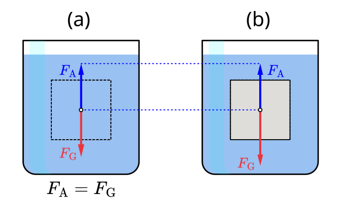
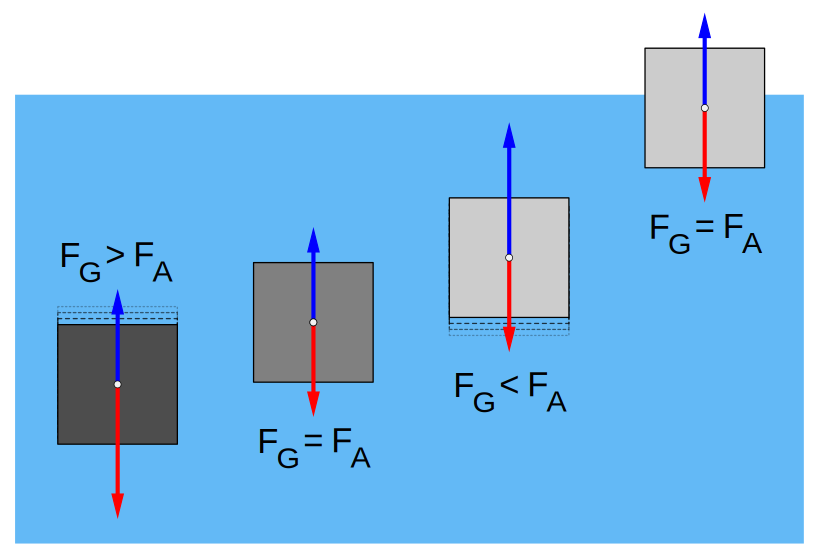

# 5.4. Siła wyporu, prawo Archimedesa, warunki pływania ciał

📚 *Zobacz na Khan Academy: [Co to jest siła wyporu? (artykuł)](https://pl.khanacademy.org/science/physics/fluids/buoyant-force-and-archimedes-principle/a/buoyant-force-and-archimedes-principle-article)*

📚 *Zobacz na Khan Academy: [Prawo Archimedesa i siła wyporu (film)](https://pl.khanacademy.org/science/physics/fluids/buoyant-force-and-archimedes-principle/v/fluids-part-5)*

Gdy zanurzamy ciało w cieczy, ciecz „napiera" na nie ze wszystkich stron. Ponieważ ciśnienie hydrostatyczne rośnie z głębokością, na spód ciała działa większe ciśnienie (a więc i większa siła) niż na jego wierzch. Różnica tych sił daje wypadkową siłę skierowaną **do góry** — nazywamy ją **siłą wyporu**.

### Prawo Archimedesa

**Prawo Archimedesa** mówi, że na ciało zanurzone w cieczy (częściowo lub całkowicie) działa siła wyporu skierowana do góry, równa co do wartości ciężarowi cieczy wypartej przez to ciało:

```
F_w = ρ_cieczy · V_zanurzone · g
```

gdzie:

- `F_w` — wartość siły wyporu (wektor — tu użyta wartość; siła wyporu jako wektor jest ZAWSZE skierowana do góry, jak opisano powyżej),
- `ρ_cieczy` — gęstość cieczy, w której zanurzone jest ciało (skalar),
- `V_zanurzone` — objętość tej części ciała, która znajduje się pod powierzchnią cieczy (skalar),
- `g` — przyspieszenie ziemskie (wektor — tu użyta jego wartość).

<div align="center">


<p><em>Rys. 4. (a) Wydzielona w myślach porcja samej cieczy jest w równowadze, więc siła wyporu <code>F_A</code> działająca na nią równa się jej ciężarowi <code>F_G</code>. (b) Ciało o takim samym kształcie i takiej samej objętości zanurzenia doznaje dokładnie takiej samej siły wyporu <code>F_A</code> (skierowanej w górę) — to istota prawa Archimedesa. To, czy ciało tonie, pływa, czy „zawisa”, zależy od tego, czy <code>F_A</code> jest mniejsza, większa, czy równa jego własnemu ciężarowi.</em></p>
<p><em>Źródło: MikeRun, licencja CC BY-SA 4.0, <a href="https://commons.wikimedia.org/wiki/File:Buoyancy-archimedes-principle.svg">Wikimedia Commons</a></em></p>
</div>

*Uwaga o oznaczeniach: na rysunkach źródłowych (Wikimedia) siła wyporu i ciężar są oznaczone jako `F_A` i `F_G` — w tekście tego materiału tym samym wielkościom odpowiadają `F_w` i `F_g`.*

### Warunki pływania ciał

Porównujemy ciężar ciała `F_g = m · g = ρ_ciała · V · g` z siłą wyporu `F_w`:

- jeśli `ρ_ciała > ρ_cieczy` → ciężar jest większy od siły wyporu (nawet gdy ciało jest w pełni zanurzone) → **ciało tonie**,
- jeśli `ρ_ciała = ρ_cieczy` → ciężar równa się sile wyporu przy pełnym zanurzeniu → **ciało „zawisa” wewnątrz cieczy** (nie tonie i nie wypływa na powierzchnię),
- jeśli `ρ_ciała < ρ_cieczy` → ciało wypływa na powierzchnię i **pływa**, zanurzając się tylko częściowo — na tyle, żeby siła wyporu (od zanurzonej części) zrównoważyła cały jego ciężar.

<div align="center">

 F_A), zawieszone w środku cieczy (F_G = F_A przy pełnym zanurzeniu), unoszące się ku powierzchni (chwilowo F_G < F_A) oraz pływające w równowadze z częściowym zanurzeniem (F_G = F_A)" width="480">
<p><em>Rys. 5. Cztery przykłady ciał o różnych gęstościach w wodzie. Od lewej: ciało gęstsze od wody tonie, bo nawet w pełni zanurzone ma <code>F_G &gt; F_A</code>. Drugie ciało ma taką samą gęstość jak woda, więc w pełni zanurzone „zawisa” w równowadze (<code>F_G = F_A</code>) na dowolnej głębokości. Trzecie i czwarte ciało są lżejsze od wody — trzecie (częściowo wynurzone) ma chwilowo <code>F_G &lt; F_A</code>, więc wypływa jeszcze wyżej, aż osiągnie równowagę pływania, w której ponownie <code>F_G = F_A</code> (czwarte ciało) — zanurzona jest wtedy tylko taka część objętości, jaka jest potrzebna, by wyporność zrównoważyła cały ciężar.</em></p>
<p><em>Źródło: MikeRun, licencja CC BY-SA 4.0, <a href="https://commons.wikimedia.org/wiki/File:Floating-and-sinking-2.svg">Wikimedia Commons</a></em></p>
</div>

### Zaskakujący przykład: dlaczego ogromny stalowy statek pływa, a mała stalowa śrubka tonie?

To jeden z ulubionych „haczyków" na sprawdzianach i konkursach — bo intuicja podpowiada błędną odpowiedź. Stal jest prawie 8 razy gęstsza od wody (ok. 7,8 g/cm³ wobec 1,0 g/cm³), więc każdy przedmiot ze stali powinien tonąć, prawda? Otóż **warunek pływania trzeba stosować do gęstości całego ciała, a nie do gęstości samego materiału, z którego jest ono zrobione**. Mała, pełna w środku stalowa śrubka to lita stal na wskroś — jej gęstość to po prostu gęstość stali, dużo większa od gęstości wody, więc śrubka tonie. Kadłub statku to zupełnie inna historia: to w gruncie rzeczy ogromna, w większości **pusta** (wypełniona powietrzem) konstrukcja ze stalowych blach. Jeśli podzielimy całkowitą masę statku (stal + wszystko na pokładzie) przez jego całkowitą objętość (stal **i** całe puste wnętrze wypełnione powietrzem), otrzymamy **średnią (uśrednioną) gęstość statku** — a ta, mimo że statek zawiera bardzo gęstą stal, wychodzi mniejsza niż gęstość wody. Dlatego statek pływa: liczy się średnia gęstość całego obiektu, nie gęstość materiału, z którego jest zbudowany.

Ten sam trik, tylko wykonywany „na żądanie", stosuje łódź podwodna: ma specjalne zbiorniki balastowe, które załoga może napełnić wodą morską (łódź zwiększa swoją średnią gęstość i zanurza się) albo opróżnić sprężonym powietrzem (średnia gęstość spada i łódź wypływa). Dzięki temu ta sama konstrukcja może zarówno unosić się na powierzchni, jak i swobodnie „zawisać" w głębi wody — wystarczy zmienić jej średnią gęstość, a nie kształt czy materiał.

### Ciekawostka: w Morzu Martwym można leżeć na wodzie i czytać książkę

Morze Martwe (na granicy Izraela i Jordanii) jest około 10 razy bardziej zasolone niż typowy ocean — zasolenie wynosi tam ok. 34%, czyli w każdym kilogramie wody rozpuszczone jest ponad 300 gramów soli! To sprawia, że gęstość tej wody sięga ok. 1,24 g/cm³ — znacznie więcej niż gęstość zwykłej wody słodkiej albo morskiej (ok. 1,0–1,03 g/cm³). Zgodnie z prawem Archimedesa (`F_w = ρ_cieczy · V_zanurzone · g`) taka sama zanurzona objętość ciała wywołuje w gęstszej cieczy większą siłę wyporu. Efekt jest tak silny, że nawet osoba, która w zwykłym basenie ledwo utrzymuje się na powierzchni, w Morzu Martwym może swobodnie leżeć na wodzie bez żadnego wysiłku — jej ciężar jest w pełni równoważony przez wypór, mimo że zanurza się tylko częściowo.

### Przykład 1 (czy ciało tonie, czy pływa?)

**Treść zadania:** Sześcian aluminiowy o krawędzi 10 cm zanurzono całkowicie w wodzie. Gęstość aluminium wynosi `2700 kg/m³`, gęstość wody — `1000 kg/m³`, `g = 10 N/kg`. Sprawdź, czy sześcian utonie, czy wypłynie na powierzchnię, obliczając siłę wyporu i ciężar sześcianu.

**Rozwiązanie krok po kroku:**

1. Obliczamy objętość sześcianu: `V = a³ = (0,1 m)³ = 0,001 m³`.
2. Obliczamy masę sześcianu: `m = ρ_Al · V = 2700 kg/m³ × 0,001 m³ = 2,7 kg`.
3. Obliczamy ciężar sześcianu: `F_g = m · g = 2,7 kg × 10 N/kg = 27 N`.
4. Obliczamy siłę wyporu (sześcian jest w pełni zanurzony, więc V_zanurzone = V): `F_w = ρ_wody · V · g = 1000 kg/m³ × 0,001 m³ × 10 N/kg = 10 N`.
5. Porównujemy: `F_g = 27 N > F_w = 10 N`.

**Odpowiedź:** Ponieważ ciężar sześcianu (`27 N`) jest większy od siły wyporu (`10 N`), sześcian aluminiowy utonie w wodzie.

### Przykład 2 (jaka część ciała jest zanurzona, gdy ciało pływa)

**Treść zadania:** Kawałek lodu o gęstości `920 kg/m³` pływa na powierzchni wody o gęstości `1000 kg/m³`. Jaka część objętości lodu znajduje się pod wodą?

**Rozwiązanie krok po kroku:**

1. Ciało pływa, czyli jest w równowadze: siła wyporu równa się ciężarowi ciała: `F_w = F_g`.
2. Zapisujemy to wzorami: `ρ_wody · V_zanurzone · g = ρ_lodu · V_całkowite · g`.
3. Skracamy `g` po obu stronach i przekształcamy: `V_zanurzone / V_całkowite = ρ_lodu / ρ_wody`.
4. Podstawiamy dane: `V_zanurzone / V_całkowite = 920 / 1000 = 0,92`.

**Odpowiedź:** Pod wodą znajduje się 92% objętości lodu (widoczne jest tylko 8% — to dlatego góry lodowe są dużo większe pod wodą, niż się wydaje znad powierzchni).

> **Ciekawostka:** To, że lód jest lżejszy od wody, w ogóle nie jest oczywiste — to jedna z niewielu naprawdę rzadkich właściwości wody! Prawie każda inna substancja w stanie stałym jest gęstsza od tej samej substancji w stanie ciekłym (np. bryłka zakrzepłego metalu tonie w tym samym metalu w stanie stopionym). Woda zachowuje się inaczej, bo cząsteczki lodu ułożone są w charakterystyczną, dość „przestronną" strukturę sieci krystalicznej, w której jest więcej wolnej przestrzeni niż w ciekłej wodzie. Gdyby lód był gęstszy od wody (jak w typowej substancji) i tonął, zbiorniki wodne w klimacie umiarkowanym zamarzałyby od dna do powierzchni, a nie od powierzchni w głąb — a życiu wodnemu zimą byłoby dużo trudniej przetrwać. Dzięki tej anomalii zamarznięta powierzchnia jeziora czy stawu działa jak „koc" izolujący cieplejszą wodę pod spodem, gdzie ryby i inne organizmy mogą przeżyć zimę.

[⬅ Powrót do spisu treści](5.0_wlasciwosci_materii_i_hydrostatyka.md)
